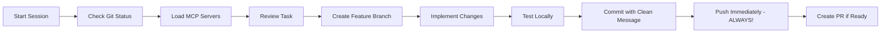

# Claude AI Assistant Configuration Hub

**Last Updated**: January 19, 2025  
**Version**: 3.0 - Modular Architecture

## 📁 Quick Navigation

This is the main configuration hub. All detailed instructions are in separate files for better organization and maintenance.

### Core Documentation
- [🚨 Git Workflow Rules](./docs/claude/GIT_RULES.md) - **CRITICAL: Read First - NEVER work on main!**
- [🗺️ Roadmap & Versioning](./docs/claude/ROADMAP_VERSIONING.md) - **Current: v2.0.0**
- [🛠️ Development Standards](./docs/claude/DEVELOPMENT_STANDARDS.md)
- [🤖 MCP Servers Guide](./docs/claude/MCP_SERVERS.md)
- [📊 Project Context](./docs/claude/PROJECT_CONTEXT.md)
- [✅ Testing & Quality](./docs/claude/TESTING_QUALITY.md)
- [🚀 Deployment Guide](./docs/claude/DEPLOYMENT.md)
- [🎨 UI/UX Guidelines](./docs/claude/UI_UX_GUIDELINES.md)
- [📈 Performance Standards](./docs/claude/PERFORMANCE.md)
- [🔒 Security Protocols](./docs/claude/SECURITY.md)
- [📝 Documentation Standards](./docs/claude/DOCUMENTATION.md)

## ⚡ Quick Start Checklist

Before any work session:
1. ✅ Check current branch: `git branch`
2. ✅ Review [Git Rules](./docs/claude/GIT_RULES.md)
3. ✅ Load [MCP Servers](./docs/claude/MCP_SERVERS.md)
4. ✅ Review [Project Context](./docs/claude/PROJECT_CONTEXT.md)

## 🎯 Primary Objectives

1. **Quality First**: Every line of code should be production-ready
2. **Performance Matters**: Optimize for speed and efficiency
3. **User Experience**: Intuitive, accessible, and delightful
4. **Maintainability**: Clean, documented, testable code
5. **Security**: Follow best practices, never expose secrets
6. **Privacy**: Always update privacy policy when data collection changes

## 🚫 CRITICAL: Code and Commit Standards

**NEVER include any of the following in code or commit messages:**
- Mentions of "Claude", "Anthropic", or any AI assistant references
- Emojis in commit messages or code
- AI-generated footers or signatures
- Any indication that AI was involved in the code generation

All code must appear as if written by a human developer.

## 🔄 Session Workflow


```mermaid
graph LR
    A[Start Session] --> B[Check Git Status]
    B --> C[Load MCP Servers]
    C --> D[Review Task]
    D --> E[Create Feature Branch]
    E --> F[Implement Changes]
    F --> G[Test Locally]
    G --> H[Commit with Clean Message]
    H --> I[Push Immediately - ALWAYS!]
    I --> J[Create PR if Ready]
```

## 🚀 Most Used Commands

```bash
# Git Workflow
git checkout main && git pull
git checkout -b feature/task-name
git add . && git commit -m "Clear message"
git push -u origin feature/task-name  # ALWAYS push after commit!

# Development
npm run dev         # Start development server
npm run build       # Build for production
npm run lint        # Check code quality
npm run test        # Run tests

# MCP Operations
claude --list-mcps  # List available MCP servers
```

## 📋 Current Project Status

- **Portfolio Version**: 2.0.0 (Released Jan 19, 2025)
- **Tech Stack**: Next.js 15.4.1, React 19, TypeScript 5, Tailwind CSS v4
- **Performance**: 96/100 Lighthouse score
- **Features**: 
  - ✅ AI-Powered Development
  - ✅ TB-scale Data Pipeline
  - ✅ 50+ MCP Servers Configured
  - ✅ Real-time Analytics
  - ✅ PWA Ready
  - ✅ SEO Optimized

## 🔗 Quick Links

- [Live Site](https://anmol.am)
- [GitHub Repo](https://github.com/anmolmanchanda/anmol.am)
- [Project Board](https://github.com/users/anmolmanchanda/projects/1)
- [Analytics Dashboard](https://vercel.com/anmolmanchanda/anmol-am/analytics)

## 💡 Remember

> "Always follow the modular documentation. Each file contains specific, detailed instructions that must be followed exactly."

## ⚠️ CRITICAL: Always Push After Commit

**NEVER leave commits unpushed locally!** After every commit, immediately push to remote:
- Local commits are invisible on GitHub
- Changes won't appear in browser until pushed
- Always verify push completed successfully

## 🔒 CRITICAL: Privacy Policy Updates

**ALWAYS update `/app/privacy/page.tsx` when making privacy-related changes:**

### When to Update:
- ✅ Adding new data collection (tracking, analytics, cookies)
- ✅ Changing what data is stored (new fields, new databases)
- ✅ Adding third-party services (APIs, SDKs, tracking scripts)
- ✅ Changing data retention policies (how long data is kept)
- ✅ Modifying IP hashing or anonymization methods
- ✅ Adding new cookies or local storage usage

### When NOT to Update:
- ❌ UI/label changes that don't affect data collection
- ❌ Bug fixes that don't change privacy behavior
- ❌ Performance optimizations without new tracking
- ❌ Visual/styling changes

### Update Checklist:
1. Update privacy policy content in `/app/privacy/page.tsx`
2. Update "Last updated" date at the top
3. Add to "Changes to This Policy" section if major
4. Review with user before deploying
5. Consider notifying users via email/banner for major changes

---

**Note**: This file serves as the central hub. Always navigate to the specific documentation files for detailed instructions. The modular structure ensures better maintenance and clarity.