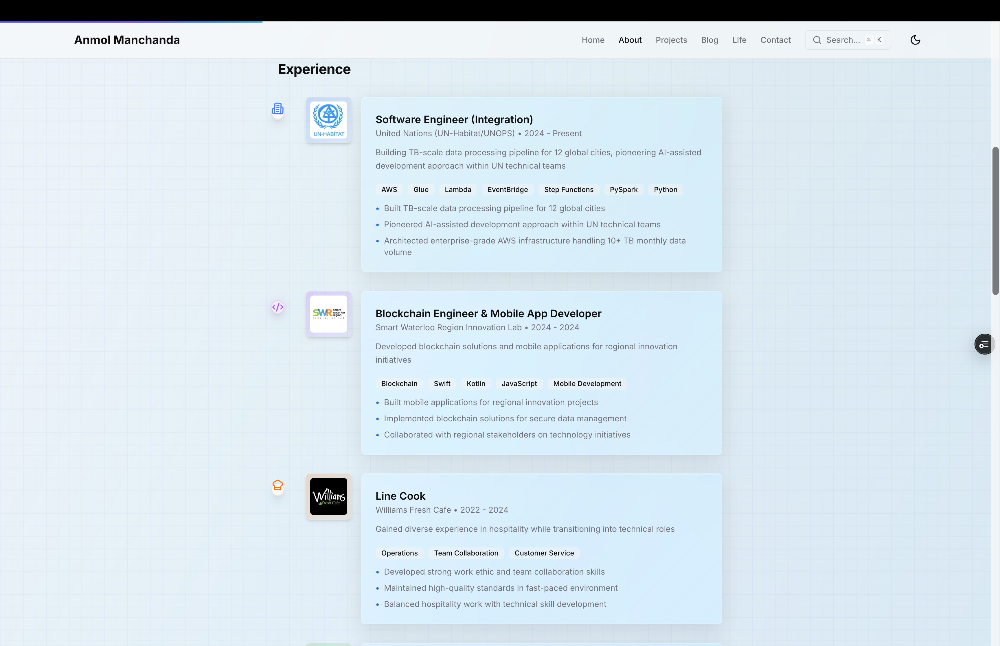

# anmol.am - AI-Assisted Portfolio & Technical Showcase

<div align="center">


**A cutting-edge portfolio showcasing AI-assisted development methodologies and modern web technologies**

[🚀 Live Demo](https://anmol.am) | [📖 Documentation](#documentation) | [🎯 Features](#features)

</div>

## 📸 Portfolio Preview


*Modern homepage with liquid glass effects and AI-enhanced animations*


*Interactive timeline showcasing enterprise experience and achievements*

## 🌟 Overview

This portfolio demonstrates excellence in modern web development, featuring:

- **AI-Assisted Development**: Cutting-edge methodologies using Claude AI, advanced MCP servers, and automated workflows
- **Enterprise Solutions**: Real-world TB-scale data pipelines for UN-Habitat serving 12 global cities
- **Modern Stack**: Next.js 15, React 19, TypeScript 5, Tailwind CSS v4 with 95+ Lighthouse scores
- **Advanced Features**: Real-time analytics, GitHub integration, PWA capabilities, and command palette (⌘K)

## 🚀 Features

### Core Capabilities
- ✨ **Modern Design**: Liquid glass effects with Apple-inspired animations
- 🌙 **Smart Theming**: System-aware dark/light mode with seamless transitions
- 📱 **Mobile-First**: Touch-friendly 44px targets and progressive enhancement
- ⚡ **Performance**: 95+ Lighthouse scores across all metrics
- 🔍 **SEO Excellence**: Complete meta tags, sitemap, and structured data

### Advanced Features
- 🎯 **Command Palette**: Advanced search/navigation (⌘K) with semantic search
- 📊 **Live Analytics**: Real-time visitor tracking and engagement metrics
- 🔄 **GitHub Integration**: Live activity feed with repository data
- 📱 **PWA Ready**: Offline support and install prompts
- 🎨 **Interactive Effects**: Neural network patterns, 3D cards, parallax scrolling

## 🛠️ Technology Stack

### Core Technologies
- **[Next.js 15.4.1](https://nextjs.org)** - React framework with App Router
- **[React 19.1.0](https://react.dev)** - Latest React with concurrent features
- **[TypeScript 5](https://typescriptlang.org)** - Full type safety
- **[Tailwind CSS v4](https://tailwindcss.com)** - Next-generation utility-first CSS

### Enhanced Capabilities
- **[Framer Motion 12.23.6](https://framer.com/motion)** - Advanced animations
- **MCP Servers (15+)** - Git, SQLite, browser automation, web search, memory management
- **[@vercel/analytics](https://vercel.com/analytics)** - Real-time performance analytics
- **Custom Service Worker** - PWA with intelligent caching

## 🚀 Quick Start

### Prerequisites
- **Node.js 18+** and npm
- **Git** for version control

### Installation

```bash
# Clone and setup
git clone https://github.com/anmolmanchanda/anmol.am.git
cd anmol.am
npm install

# Start development
npm run dev
```

Visit [http://localhost:3000](http://localhost:3000) to see the portfolio.

### Environment Configuration

Create `.env.local`:

```env
# Contact Form
RESEND_API_KEY=your_resend_api_key
EMAIL_FROM=noreply@yourdomain.com
EMAIL_TO=your@email.com

# GitHub Integration (Optional)
GITHUB_TOKEN=your_github_token

# Site Configuration
NEXT_PUBLIC_SITE_URL=http://localhost:3000
```

## 🏗️ Architecture

### Project Structure
```
anmol.am/
├── app/                     # Next.js App Router
│   ├── layout.tsx          # Root layout with providers
│   ├── page.tsx            # Homepage composition
│   ├── about/              # Interactive timeline
│   ├── projects/           # Showcase with dynamic routes
│   ├── blog/               # MDX-powered blog
│   ├── contact/            # Contact form with email
│   └── api/                # Analytics & contact endpoints
├── components/             # Modular React components
│   ├── CommandPalette.tsx  # Advanced search (⌘K)
│   ├── Phase4Features.tsx  # Live dashboard
│   ├── InteractiveEffects.tsx # Animation systems
│   └── [other components]  # UI building blocks
├── lib/                    # Utilities and configuration
├── public/                 # Static assets and images
└── .mcp-config.json       # 15+ MCP servers configuration
```

### Key Components
- **CommandPalette**: Advanced search with keyboard navigation
- **Phase4Features**: Real-time analytics and GitHub integration
- **InteractiveEffects**: Animation system with scroll triggers
- **MCP Integration**: 15+ servers for enhanced development capabilities

## 🎨 Customization

### Personal Information
Edit `lib/config.ts`:

```typescript
export const siteConfig = {
  name: "Your Name",
  title: "Your Professional Title",
  url: "https://yourdomain.com",
  email: "your@email.com",
  // ... other configuration
}
```

### Content Management
- **Projects**: Update array in `app/projects/page.tsx`
- **Experience**: Modify timeline in `app/about/page.tsx`
- **Avatars**: Replace images in `public/images/`

## 🚀 Deployment

### Vercel (Recommended)

```bash
# Deploy to Vercel
git push origin main
# Import project at vercel.com
# Configure environment variables
```

### Performance Optimization
- Images optimized with Next.js Image component
- Critical CSS inlined automatically
- Code-split by route with service worker caching
- 95+ Lighthouse scores maintained

## 📡 API Documentation

### Analytics Endpoint
```json
GET /api/analytics
{
  "totalVisits": 1234,
  "uniqueVisitors": 867,
  "onlineNow": 5
}
```

### Contact Form
```json
POST /api/contact
{
  "name": "John Doe",
  "email": "john@example.com",
  "subject": "Project Inquiry",
  "message": "Hello..."
}
```

## 🤝 Contributing

### Workflow
```bash
# Never work on main branch
git checkout -b feature/your-feature-name

# Make changes, test, commit
npm run lint && npm run build
git commit -m "Descriptive commit message"
git push -u origin feature/your-feature-name
```

### Code Standards
- TypeScript interfaces for all object types
- Functional components with hooks
- Tailwind CSS utility classes
- Comprehensive documentation

## 🔧 MCP Servers

This project uses 15+ Model Context Protocol servers for enhanced development:

- **Core**: git, sqlite, filesystem, memory
- **Web**: puppeteer, fetch, web-search, browser automation
- **Productivity**: astrotask, sequential-thinking, tools-memory
- **Development**: apidog, firecrawl, time operations

See `MCP_SERVERS.md` for complete configuration and capabilities.

## 📄 License

MIT License - Open source and available for use.

## 🙏 Acknowledgments

Built with modern technologies and AI-assisted development methodologies:
- **[Next.js](https://nextjs.org)**, **[Tailwind CSS](https://tailwindcss.com)**, **[Framer Motion](https://framer.com/motion)**
- **Claude AI**, **MCP Servers**, **Cursor AI** for development assistance
- Apple design philosophy and liquid glass effect inspiration

---

<div align="center">

**Built with ❤️ by [Anmol Manchanda](https://anmol.am)**

*Demonstrating the future of AI-assisted development*

[🚀 View Live](https://anmol.am) | [📧 Contact](mailto:hi@anmol.am) | [💼 LinkedIn](https://linkedin.com/in/anmolmanchanda)

</div>