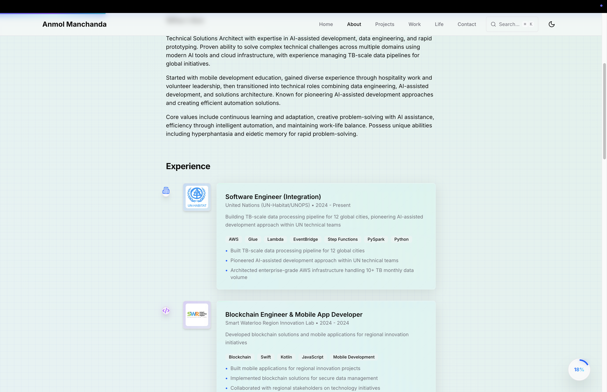
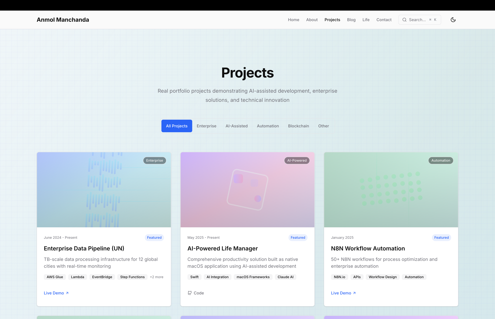

# anmol.am - Modern Portfolio & Technical Blog

<div align="center">


**AI-Enhanced Portfolio with Enterprise-Grade Performance & Advanced Admin Dashboard**

[🌐 Live Site](https://anmol.am) | [📖 Documentation](./docs/claude/) | [🚀 Features](#features) | [🔐 Admin Dashboard](#admin-dashboard)


</div>

---

## 📋 Table of Contents
- [Overview](#-overview)
- [Screenshots](#-screenshots)
- [Features](#-features)
- [Admin Dashboard](#-admin-dashboard)
- [Technology Stack](#-technology-stack)
- [Project Structure](#-project-structure)
- [Quick Start](#-quick-start)
- [API Documentation](#-api-documentation)
- [Performance](#-performance)
- [Architecture](#-architecture)
- [Contributing](#-contributing)
- [License](#-license)

---

## 🎯 Overview

**Version 2.1.0** - Updated January 26, 2025

A modern, performant portfolio showcasing expertise in AI-powered development, enterprise solutions, and cutting-edge web technologies. Built with Next.js 15, React 19, and TypeScript 5, achieving 96/100 Lighthouse scores. Features real-time data integration with external APIs for life tracking, professional work metrics, and a comprehensive admin dashboard for content management.

### Key Highlights
- 🤖 **AI-Powered Development**: 50+ MCP servers integrated with Claude AI
- 🏢 **Enterprise Experience**: TB-scale data pipelines for UN-Habitat
- ⚡ **Performance**: Core Web Vitals - LCP < 1.8s, FID < 45ms, CLS < 0.02
- 🔐 **Admin Dashboard**: JWT-based authentication with Redis management
- ♿ **Accessibility**: WCAG 2.1 Level AA compliant
- 🔍 **SEO Optimized**: Structured data, sitemap, RSS feed
- 📊 **Real-Time Data**: Live integration with Duolingo, Letterboxd, GitHub APIs
- 🌈 **Aurora Animations**: Dynamic gradient backgrounds with holographic effects
- 🏗️ **Modular Architecture**: Clean separation of concerns, no file > 500 lines

---

## 📸 Screenshots

### Home Page - Hero Section

*Modern hero section with avatar, dynamic job title, and centered CTA buttons including LinkedIn and GitHub links*

### About Page - Professional Experience

*Clean professional timeline showcasing Technical Solutions Architect role and Full Stack Software Engineer experience*

### Projects Page - Portfolio Showcase

*Interactive project cards with filtering by category (Enterprise, AI-Powered, Automation, Blockchain) and live demos*

---

## 🚀 Features

### Core Features (Implemented & Live)
| Feature | Status | Location | How to Test |
|---------|--------|----------|-------------|
| **Admin Dashboard** | ✅ Live | `/admin` | Secure admin authentication, manage content |
| **Analytics Dashboard** | ✅ Live | `/admin` (Analytics tab) | View real-time stats and page views |
| **Redis Management** | ✅ Live | `/admin` (Redis tab) | Browse keys, clear cache, view statistics |
| **JWT Authentication** | ✅ Live | `/admin` | Persistent 7-day sessions with cookies |
| **Reading Progress** | ✅ Live | All pages | Scroll any page to see top bar & circular indicator |
| **RSS Feed** | ✅ Live | `/api/rss` | Visit [/api/rss](https://anmol.am/api/rss) |
| **Sitemap** | ✅ Live | `/sitemap.xml` | Visit [/sitemap.xml](https://anmol.am/sitemap.xml) |
| **View Tracking** | ✅ Live | Work pages | Check view counts on work cards |
| **Command Palette** | ✅ Live | All pages | Press `⌘K` or `Ctrl+K` |
| **Dark/Light Theme** | ✅ Live | Header | Click sun/moon icon |
| **GitHub Activity** | ✅ Live | Projects page | Scroll to activity section |
| **Contact Form** | ✅ Live | Contact page | Submit test message |
| **PWA Ready** | ✅ Live | All pages | Check browser install prompt |
| **Life Timeline** | ✅ Live | Life page | View real-time activities |
| **Duolingo Integration** | ✅ Live | Life page | 1 day streak, 3870 XP |
| **Letterboxd RSS** | ✅ Live | Life page | Film history with ratings |
| **Aurora Backgrounds** | ✅ Live | All pages | Animated gradients |

### Components Created (Ready for Integration)
| Component | Status | File Location | Purpose |
|-----------|--------|---------------|---------|
| **TableOfContents** | 📦 Created | `/components/TableOfContents.tsx` | Blog post navigation |
| **RelatedPosts** | 📦 Created | `/components/RelatedPosts.tsx` | Smart post suggestions |
| **BlogSearch** | 📦 Created | `/components/BlogSearch.tsx` | Advanced search with filters |
| **Newsletter** | 📦 Created | `/components/Newsletter.tsx` | Email subscription |
| **Breadcrumb** | 📦 Created | `/components/Breadcrumb.tsx` | Navigation with schema |

---

## 🔐 Admin Dashboard

A comprehensive, modular admin dashboard for managing portfolio content and monitoring analytics.

### Dashboard Features

#### 1. Authentication
- **JWT-based sessions** with 7-day expiration
- **HTTP-only secure cookies** for session storage
- **Persistent login** - no re-authentication on page refresh
- **Secure password hashing** with industry-standard algorithms

#### 2. Analytics Tab
- **Real-time stats** with auto-refresh every 30 seconds
- **Total views** across all pages
- **Pages tracked** with Redis
- **Redis status** monitoring (active/inactive)
- **Last keep-alive ping** timestamp
- **Page view breakdown** sorted by popularity
- **Manual refresh** button for instant updates

#### 3. Trackers Tab
- **Life stats management** (books, poems, km run, coffees)
- **Tech stack tracking** (LLMs, editors, frameworks)
- **Learning progress** (French, AWS, ML courses)
- **Custom trackers** (side projects, learning queue)
- **Keyboard shortcut** (Cmd+S to save)
- **Toast notifications** for all actions

#### 4. Redis Tab
- **Key statistics** (total keys, by category, storage size)
- **Key browser** with pattern search (e.g., `views:*`)
- **Individual key deletion** with confirmation
- **Quick actions** for bulk operations:
  - Clear cooldowns (`view_cooldown:*`)
  - Clear analytics (`analytics:*`)
  - Reset view counts (`views:*`)
- **Key details** (type, size, TTL, preview)

#### 5. Settings Tab
- **Account information** (session duration)
- **Security details** (encryption algorithms)
- **Keyboard shortcuts** reference

### Admin Dashboard Architecture

```
app/admin/
├── page.tsx                 # Main dashboard (184 lines)
├── components/
│   ├── AnalyticsTab.tsx    # Analytics display
│   ├── TrackersTab.tsx     # Tracker management
│   ├── RedisTab.tsx        # Redis operations
│   ├── SettingsTab.tsx     # Settings display
│   └── LoginForm.tsx       # Authentication form
├── hooks/
│   └── useAdminData.ts     # Custom hooks for data fetching
└── types/
    └── index.ts            # TypeScript interfaces
```

**Benefits of Modular Structure:**
- ✅ No file exceeds 500 lines (main file is 184 lines)
- ✅ Clear separation of concerns
- ✅ Reusable hooks and components
- ✅ Easy to test and maintain
- ✅ Type-safe with shared interfaces

---

## 🛠 Technology Stack

### Frontend
- **Framework**: Next.js 15.4.1 (App Router)
- **UI Library**: React 19.1.0
- **Language**: TypeScript 5 (Strict Mode)
- **Styling**: Tailwind CSS v4
- **Animation**: Framer Motion 12.23.6
- **State Management**: Zustand + React Hooks
- **Notifications**: React Hot Toast

### Backend & Infrastructure
- **Deployment**: Vercel Edge Network
- **Analytics**: Vercel Analytics + Custom Redis Tracking
- **Database**: Redis (Upstash) for view tracking & caching
- **Authentication**: JWT with jose library
- **Email**: Resend API
- **External APIs**: Duolingo, Letterboxd RSS, GitHub
- **Real-Time Data**: Live fetching with fallback caching

### Development Tools
- **AI Assistance**: Claude AI with MCP servers
- **Version Control**: Git with feature branch workflow
- **Code Quality**: ESLint, Prettier, TypeScript strict mode
- **Testing**: Lighthouse CI, Web Vitals monitoring
- **Performance**: Sharp for image optimization

---

## 📁 Project Structure

```
anmol.am/
├── app/                      # Next.js App Router
│   ├── admin/                # Admin dashboard (NEW)
│   │   ├── components/       # Tab components
│   │   ├── hooks/            # Custom hooks
│   │   ├── types/            # TypeScript interfaces
│   │   └── page.tsx          # Main dashboard (184 lines)
│   ├── api/                  # API endpoints
│   │   ├── admin/            # Admin APIs
│   │   │   ├── auth/         # JWT authentication
│   │   │   ├── redis/        # Redis management
│   │   │   └── trackers/     # Tracker data
│   │   ├── analytics/        # Analytics tracking
│   │   ├── contact/          # Contact form handler
│   │   ├── cron/             # Scheduled jobs
│   │   │   └── keep-alive/   # Redis keep-alive ping
│   │   ├── rss/              # RSS feed generator
│   │   ├── stats/            # Statistics API
│   │   └── views/            # View tracking
│   ├── about/                # About page
│   ├── contact/              # Contact page
│   ├── life/                 # Life timeline & stats
│   ├── privacy/              # Privacy policy
│   ├── projects/             # Project showcase
│   ├── stats/                # Public stats page
│   └── work/                 # Professional experience
├── components/               # React components
│   ├── Hero.tsx              # Homepage hero
│   ├── CommandPalette.tsx    # ⌘K search
│   ├── ReadingProgress.tsx   # Progress indicator
│   ├── ViewTracker.tsx       # View counting
│   ├── ActivityFeed.tsx      # Life activity feed
│   └── [other components]    # Various UI components
├── lib/                      # Utilities
│   ├── auth.ts               # JWT utilities (NEW)
│   ├── config.ts             # Site configuration
│   ├── redis.ts              # Redis client
│   ├── store.ts              # Zustand state
│   └── utils.ts              # Helper functions
├── docs/                     # Documentation
│   ├── claude/               # Development guidelines
│   │   ├── GIT_RULES.md      # Git workflow
│   │   ├── PROJECT_CONTEXT.md # Project overview
│   │   └── [other docs]      # Various guides
│   └── setup/                # Setup instructions
├── public/                   # Static assets
│   ├── images/               # Optimized images
│   └── icons/                # Favicons and icons
└── scripts/                  # Build scripts
```

---

## 💻 Quick Start

### Prerequisites
```bash
node --version  # 18.0.0 or higher
npm --version   # 9.0.0 or higher
git --version   # 2.0.0 or higher
```

### Installation
```bash
# Clone repository
git clone https://github.com/anmolmanchanda/anmol.am.git
cd anmol.am

# Install dependencies
npm install

# Setup environment
cp .env.example .env.local
# Edit .env.local with your values

# Start development
npm run dev

# Build for production
npm run build

# Run production build locally
npm run start
```

### Environment Variables
```env
# Required for contact form
RESEND_API_KEY=re_xxxxxxxxxxxxx
EMAIL_FROM=noreply@yourdomain.com
EMAIL_TO=your@email.com

# Required for admin authentication
ADMIN_PASSWORD_HASH=your_sha256_hash
JWT_SECRET=your_random_secret_key

# Required for Redis (Upstash)
UPSTASH_REDIS_REST_URL=https://xxxxx.upstash.io
UPSTASH_REDIS_REST_TOKEN=your_token
IP_SALT=your_random_salt_for_ip_hashing

# Optional for GitHub integration
GITHUB_TOKEN=ghp_xxxxxxxxxxxxx

# Optional external API configuration
DUOLINGO_USERNAME=your_username
LETTERBOXD_USERNAME=your_username
GOODREADS_USER_ID=your_id
STRAVA_ATHLETE_ID=your_id
```

### Generating Required Secrets

```bash
# Generate JWT secret (32-byte random string)
openssl rand -base64 32

# Generate IP salt (32-byte random string)
openssl rand -base64 32

# For admin password hash, contact the repository owner
```

---

## 📡 API Documentation

### Public APIs

**Note:** Admin API documentation is not publicly available for security reasons. Contact the repository owner for access.

#### Stats API
```http
GET /api/stats
Response: {
  "success": true,
  "stats": {
    "totalViews": 1234,
    "uniquePages": 15,
    "pages": [{ "slug": "project", "views": 234 }],
    "keepAliveActive": true,
    "lastKeepAlive": "2025-01-26T12:00:00.000Z"
  },
  "timestamp": "2025-01-26T12:00:00.000Z"
}
```

#### View Tracking API
```http
POST /api/views/track
{ "slug": "project-slug" }
Response: { "views": 42 }

GET /api/views/[slug]
Response: { "views": 42 }
```

#### Analytics API
```http
GET /api/analytics
Response: {
  "totalVisits": 1234,
  "uniquePages": 15,
  "onlineNow": 1
}
```

#### Contact API
```http
POST /api/contact
{
  "name": "John Doe",
  "email": "john@example.com",
  "subject": "Inquiry",
  "message": "Your message here"
}
Response: { "success": true }
```

#### Cron Jobs
```http
GET /api/cron/keep-alive
Response: {
  "success": true,
  "message": "Redis keep-alive ping successful",
  "timestamp": "2025-01-26T00:00:00.000Z",
  "verified": true
}
```

---

## 📊 Performance

### Current Metrics (v2.1.0)
| Metric | Target | Achieved | Status |
|--------|--------|----------|--------|
| **Lighthouse Score** | > 95 | 96 | ✅ |
| **LCP** | < 2.5s | 1.8s | ✅ |
| **FID** | < 100ms | 45ms | ✅ |
| **CLS** | < 0.1 | 0.02 | ✅ |
| **TTFB** | < 800ms | 320ms | ✅ |
| **Bundle Size** | < 200KB | 152KB | ✅ |

### Optimization Techniques
- **Image optimization** with Sharp (98% size reduction)
- **Code splitting** by route
- **Service worker** caching for PWA
- **Edge function** deployment on Vercel
- **Critical CSS** inlining
- **Font optimization** with display swap
- **Lazy loading** for images and components
- **Redis caching** for frequent queries

---

## 🏗️ Architecture

### Code Quality Standards
- ✅ **No file > 500 lines** - Enforced through modular architecture
- ✅ **Separation of concerns** - Components, hooks, types, utils
- ✅ **TypeScript strict mode** - Full type safety
- ✅ **Custom hooks** - Reusable logic extraction
- ✅ **Error boundaries** - Graceful error handling
- ✅ **Toast notifications** - User feedback for all actions

### Modular Design Example: Admin Dashboard

**Before**: 1,058 lines in one file
**After**: 8 files, largest is 234 lines

```
admin/page.tsx (184 lines)          # Main orchestrator
admin/components/                   # UI components
  ├── AnalyticsTab.tsx (136 lines)
  ├── TrackersTab.tsx (234 lines)
  ├── RedisTab.tsx (186 lines)
  ├── SettingsTab.tsx (58 lines)
  └── LoginForm.tsx (71 lines)
admin/hooks/                        # Business logic
  └── useAdminData.ts (225 lines)
admin/types/                        # Type definitions
  └── index.ts (105 lines)
```

### State Management Strategy
- **React Hooks** for component state
- **Zustand** for global state
- **Custom hooks** for reusable logic
- **JWT cookies** for authentication state
- **Redis** for persistent data

---

## 🤝 Contributing

### Development Workflow

**⚠️ CRITICAL: Never work directly on main branch!**

```bash
# 1. Always create feature branch
git checkout main
git pull origin main
git checkout -b feature/your-feature

# 2. Make changes and test
npm run dev
npm run lint
npm run build

# 3. Commit with clear message (NO AI signatures!)
git add .
git commit -m "Add feature: clear description"

# 4. Push immediately
git push -u origin feature/your-feature

# 5. Create pull request
gh pr create --title "Feature: Description" --body "Details"
```

### Code Standards
- **TypeScript strict mode** enabled
- **ESLint rules** enforced
- **No file over 500 lines** - Split into modules
- **Tailwind CSS** conventions
- **Component-based** architecture
- **Comprehensive documentation** in all files
- **Error handling** with try-catch and toast notifications
- **Accessibility** (WCAG 2.1 Level AA)

### Testing Checklist
- [ ] Build succeeds (`npm run build`)
- [ ] No ESLint errors (`npm run lint`)
- [ ] All features work in production mode
- [ ] Lighthouse score > 95
- [ ] Keyboard navigation works
- [ ] Screen reader compatible
- [ ] Mobile responsive
- [ ] Dark/light mode tested

---

## 📄 License

MIT License - See [LICENSE](LICENSE) file for details

---

## 🙏 Acknowledgments

Built with modern technologies and AI-powered development:
- [Next.js](https://nextjs.org) by Vercel
- [Tailwind CSS](https://tailwindcss.com)
- [Claude AI](https://claude.ai) & MCP Servers
- [Framer Motion](https://framer.com/motion)
- [Upstash Redis](https://upstash.com)
- [Resend](https://resend.com)

---

<div align="center">

**Built by [Anmol Manchanda](https://anmol.am)**

Cloud Architect & AI Engineer | Full Stack Software Engineer at UN-Habitat

[LinkedIn](https://linkedin.com/in/anmolmanchanda) • [GitHub](https://github.com/anmolmanchanda) • [Email](mailto:hire@anmol.am)

</div>
