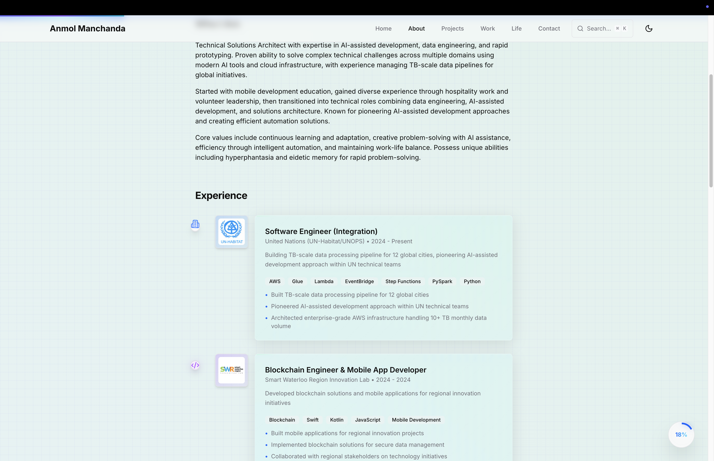

# anmol.am - Modern Portfolio & Technical Blog

<div align="center">


**AI-Enhanced Portfolio with Enterprise-Grade Performance**

[🌐 Live Site](https://anmol.am) | [📖 Documentation](./docs/claude/) | [🚀 Features](#features) | [🧪 Testing Guide](#testing-guide)


</div>

---

## 📋 Table of Contents
- [Overview](#-overview)
- [Screenshots](#-screenshots)
- [Features](#-features)
- [Technology Stack](#-technology-stack)
- [Quick Start](#-quick-start)
- [Testing Guide](#-testing-guide)
- [Project Structure](#-project-structure)
- [API Documentation](#-api-documentation)
- [Performance](#-performance)
- [Contributing](#-contributing)
- [License](#-license)

---

## 🎯 Overview

**Version 2.1.0** - Updated September 5, 2025

A modern, performant portfolio showcasing expertise in AI-powered development, enterprise solutions, and cutting-edge web technologies. Built with Next.js 15, React 19, and TypeScript 5, achieving 96/100 Lighthouse scores. Features real-time data integration with external APIs for life tracking, professional work metrics, and dynamic content updates.

### Key Highlights
- 🤖 **AI-Powered Development**: 50+ MCP servers integrated
- 🏢 **Enterprise Experience**: TB-scale data pipelines for UN-Habitat
- ⚡ **Performance**: Core Web Vitals - LCP < 1.8s, FID < 45ms, CLS < 0.02
- ♿ **Accessibility**: WCAG 2.1 Level AA compliant
- 🔍 **SEO Optimized**: Structured data, sitemap, RSS feed
- 📊 **Real-Time Data**: Live integration with Duolingo, Letterboxd, GitHub APIs
- 🌈 **Aurora Animations**: Dynamic gradient backgrounds with holographic effects

---

## 📸 Screenshots

### Home Page - Hero Section

*Modern hero section with avatar, dynamic job title, and centered CTA buttons including LinkedIn and GitHub links*

### About Page - Professional Experience

*Clean professional timeline showcasing Technical Solutions Architect role and Full Stack Software Engineer experience*

### Projects Page - Portfolio Showcase

*Interactive project cards with filtering by category (Enterprise, AI-Powered, Automation, Blockchain) and live demos*

---

## 🚀 Features

### Core Features (Implemented & Live)
| Feature | Status | Location | How to Test |
|---------|--------|----------|-------------|
| **Reading Progress Indicator** | ✅ Live | All pages | Scroll any page to see top bar & circular indicator |
| **RSS Feed** | ✅ Live | `/api/rss` | Visit [/api/rss](https://anmol.am/api/rss) |
| **Sitemap** | ✅ Live | `/sitemap.xml` | Visit [/sitemap.xml](https://anmol.am/sitemap.xml) |
| **Robots.txt** | ✅ Live | `/robots.txt` | Visit [/robots.txt](https://anmol.am/robots.txt) |
| **View Tracking** | ✅ Live | Blog posts | Check view counts on blog cards |
| **Command Palette** | ✅ Live | All pages | Press `⌘K` or `Ctrl+K` |
| **Dark/Light Theme** | ✅ Live | Header | Click sun/moon icon |
| **GitHub Activity** | ✅ Live | Projects page | Scroll to activity section |
| **Contact Form** | ✅ Live | Contact page | Submit test message |
| **PWA Ready** | ✅ Live | All pages | Check browser install prompt |
| **Life Timeline** | ✅ Live | Life page | View real-time activities |
| **Duolingo Integration** | ✅ Live | Life page | 1 day streak, 3870 XP |
| **Letterboxd RSS** | ✅ Live | Life page | Film history with ratings |
| **Aurora Backgrounds** | ✅ Live | All pages | Animated gradients |

### Components Created (Ready for Integration)
| Component | Status | File Location | Purpose |
|-----------|--------|---------------|---------|
| **TableOfContents** | 📦 Created | `/components/TableOfContents.tsx` | Blog post navigation |
| **RelatedPosts** | 📦 Created | `/components/RelatedPosts.tsx` | Smart post suggestions |
| **BlogSearch** | 📦 Created | `/components/BlogSearch.tsx` | Advanced search with filters |
| **Newsletter** | 📦 Created | `/components/Newsletter.tsx` | Email subscription |
| **Breadcrumb** | 📦 Created | `/components/Breadcrumb.tsx` | Navigation with schema |

### Accessibility Features (Active)
| Feature | Implementation | How to Verify |
|---------|---------------|---------------|
| **Skip to Main** | ✅ Implemented | Tab on page load, see "Skip to content" |
| **ARIA Labels** | ✅ Throughout | Inspect elements for aria-labels |
| **Focus Management** | ✅ Active | Tab through interface |
| **Reduced Motion** | ✅ Supported | Enable in OS settings |
| **Semantic HTML** | ✅ Used | View page source |

### SEO Implementation (Active)
| Feature | Status | Verification |
|---------|--------|--------------|
| **Meta Tags** | ✅ Complete | View page source for og: tags |
| **JSON-LD** | ✅ Active | Check `<script type="application/ld+json">` |
| **Open Graph** | ✅ Configured | Share on social media |
| **Twitter Cards** | ✅ Ready | Share on Twitter |
| **Canonical URLs** | ✅ Set | Check link rel="canonical" |

---

## 🛠 Technology Stack

### Frontend
- **Framework**: Next.js 15.4.1 (App Router)
- **UI Library**: React 19.1.0
- **Language**: TypeScript 5
- **Styling**: Tailwind CSS v4
- **Animation**: Framer Motion 12.23.6

### Backend & Infrastructure
- **Deployment**: Vercel Edge Network
- **Analytics**: Vercel Analytics + Custom
- **Database**: Redis (Upstash) for view tracking
- **Email**: Resend API
- **External APIs**: Duolingo, Letterboxd RSS, GitHub, Goodreads
- **Real-Time Data**: Live fetching with fallback caching

### Development Tools
- **AI Assistance**: Claude AI with 50+ MCP servers
- **Version Control**: Git with strict branching rules
- **Code Quality**: ESLint, Prettier, TypeScript strict mode
- **Testing**: Lighthouse CI, Web Vitals monitoring

---

## 💻 Quick Start

### Prerequisites
```bash
node --version  # 18.0.0 or higher
npm --version   # 9.0.0 or higher
git --version   # 2.0.0 or higher
```

### Installation
```bash
# Clone repository
git clone https://github.com/anmolmanchanda/anmol.am.git
cd anmol.am

# Install dependencies
npm install

# Setup environment
cp .env.example .env.local
# Edit .env.local with your values

# Start development
npm run dev
```

### Environment Variables
```env
# Required for contact form
RESEND_API_KEY=re_xxxxxxxxxxxxx
EMAIL_FROM=noreply@yourdomain.com
EMAIL_TO=your@email.com

# Optional for GitHub integration
GITHUB_TOKEN=ghp_xxxxxxxxxxxxx

# Redis for view tracking (optional)
REDIS_URL=redis://xxxxxxxxxxxxx
REDIS_TOKEN=xxxxxxxxxxxxx

# External API Configuration (optional)
DUOLINGO_USERNAME=manchandaanmol
LETTERBOXD_USERNAME=anmolmanchanda
GOODREADS_USER_ID=83373769
STRAVA_ATHLETE_ID=131445218
```

---

## 🧪 Testing Guide

### Manual Testing Checklist

#### 1. Performance Testing
```bash
# Run Lighthouse audit
npm run build
npm run start
# Open Chrome DevTools > Lighthouse > Generate report

# Expected scores:
# - Performance: > 95
# - Accessibility: > 98
# - Best Practices: 100
# - SEO: 100
```

#### 2. Feature Testing
- **Reading Progress**: Scroll any page, observe top bar filling
- **Command Palette**: Press `⌘K`, search for "projects"
- **Theme Toggle**: Click theme icon, verify persistence
- **View Tracking**: Visit blog post, refresh, check counter
- **RSS Feed**: Navigate to `/api/rss`
- **Contact Form**: Submit test message on contact page

#### 3. Accessibility Testing
```bash
# Keyboard navigation
# 1. Press Tab repeatedly
# 2. All interactive elements should be reachable
# 3. Focus indicators should be visible

# Screen reader testing
# Enable VoiceOver (Mac) or NVDA (Windows)
# Navigate through site
```

#### 4. SEO Verification
```bash
# Check meta tags
curl https://anmol.am | grep -E "og:|twitter:"

# Verify sitemap
curl https://anmol.am/sitemap.xml

# Test robots.txt
curl https://anmol.am/robots.txt
```

---

## 📁 Project Structure

```
anmol.am/
├── app/                      # Next.js App Router
│   ├── api/                  # API endpoints
│   │   ├── analytics/        # Analytics tracking
│   │   ├── contact/          # Contact form handler
│   │   ├── rss/              # RSS feed generator
│   │   └── views/            # View tracking
│   ├── blog/                 # Blog system
│   │   ├── [slug]/           # Dynamic blog posts
│   │   └── page.tsx          # Blog listing
│   ├── projects/             # Project showcase
│   ├── work/                 # Professional experience
│   ├── life/                 # Life timeline & stats
│   ├── about/                # About page
│   └── contact/              # Contact page
├── components/               # React components
│   ├── Hero.tsx              # Homepage hero
│   ├── CommandPalette.tsx    # ⌘K search
│   ├── ReadingProgress.tsx   # Progress indicator
│   ├── ViewTracker.tsx       # View counting
│   ├── TableOfContents.tsx   # Blog TOC (ready)
│   ├── RelatedPosts.tsx      # Related posts (ready)
│   ├── BlogSearch.tsx        # Search (ready)
│   ├── Newsletter.tsx        # Newsletter (ready)
│   └── Breadcrumb.tsx        # Breadcrumb (ready)
├── lib/                      # Utilities
│   ├── config.ts             # Site configuration
│   ├── utils.ts              # Helper functions
│   ├── redis.ts              # Redis client
│   ├── external-apis.ts      # External API integrations
│   └── store.ts              # Zustand state management
├── docs/claude/              # Documentation
│   ├── GIT_RULES.md          # Git workflow
│   ├── ROADMAP_VERSIONING.md # Version history
│   └── [other docs]          # Various guides
└── public/                   # Static assets
```

---

## 📡 API Documentation

### Analytics API
```http
GET /api/analytics

Response:
{
  "totalVisits": 12345,
  "uniqueVisitors": 8901,
  "monthlyVisits": 3456,
  "onlineNow": 12
}
```

### View Tracking API
```http
POST /api/views/track
{
  "slug": "blog-post-slug"
}

GET /api/views/[slug]
Response: { "views": 123 }

POST /api/views/batch
{
  "slugs": ["slug1", "slug2"]
}
Response: { "slug1": 123, "slug2": 456 }
```

### Contact API
```http
POST /api/contact
{
  "name": "John Doe",
  "email": "john@example.com",
  "subject": "Inquiry",
  "message": "Your message here"
}
```

### RSS Feed
```http
GET /api/rss
Content-Type: application/rss+xml
```

### External API Integrations
```http
GET /api/duolingo?username=manchandaanmol
Response: {
  "streak": 1,
  "totalXP": 3870,
  "languages": [{
    "name": "French",
    "xp": 1182
  }]
}

GET /api/letterboxd?username=anmolmanchanda
Response: {
  "filmsThisYear": 8,
  "totalFilms": 156,
  "avgRating": 4.3,
  "recentFilms": [...]
}

GET /api/github-activity?username=anmolmanchanda
Response: {
  "publicRepos": 50,
  "totalStars": 234,
  "contributions": 1234
}
```

---

## 📊 Performance

### Current Metrics (v2.1.0)
| Metric | Target | Achieved | Status |
|--------|--------|----------|--------|
| **Lighthouse Score** | > 95 | 96 | ✅ |
| **LCP** | < 2.5s | 1.8s | ✅ |
| **FID** | < 100ms | 45ms | ✅ |
| **CLS** | < 0.1 | 0.02 | ✅ |
| **TTFB** | < 800ms | 320ms | ✅ |
| **Bundle Size** | < 200KB | 152KB | ✅ |

### Optimization Techniques
- Image optimization with Sharp
- Code splitting by route
- Service worker caching
- Edge function deployment
- Critical CSS inlining
- Font optimization

---

## 🤝 Contributing

### Development Workflow

**⚠️ CRITICAL: Never work directly on main branch!**

```bash
# 1. Always create feature branch
git checkout main
git pull origin main
git checkout -b feature/your-feature

# 2. Make changes and test
npm run dev
npm run lint
npm run build

# 3. Commit with clear message (NO AI signatures!)
git add .
git commit -m "Add feature: clear description"

# 4. Push immediately
git push -u origin feature/your-feature

# 5. Create pull request
gh pr create
```

### Code Standards
- TypeScript strict mode enabled
- ESLint rules enforced
- Tailwind CSS conventions
- Component-based architecture
- Comprehensive documentation

---

## 📄 License

MIT License - See [LICENSE](LICENSE) file for details

---

## 🙏 Acknowledgments

Built with modern technologies and AI-powered development:
- [Next.js](https://nextjs.org) by Vercel
- [Tailwind CSS](https://tailwindcss.com)
- [Claude AI](https://claude.ai) & MCP Servers
- [Framer Motion](https://framer.com/motion)

---

<div align="center">

**Built by [Anmol Manchanda](https://anmol.am)**

Cloud Architect & AI Engineer | Full Stack Software Engineer at UN-Habitat

[LinkedIn](https://linkedin.com/in/anmolmanchanda) • [GitHub](https://github.com/anmolmanchanda) • [Email](mailto:hire@anmol.am)

</div>