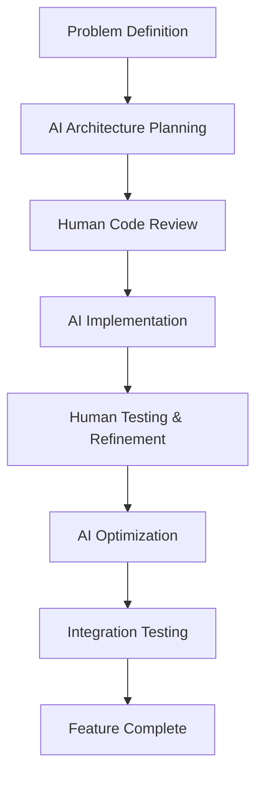

# AI-Assisted Development: Building a Native macOS Life Manager

The future of software development isn't replacing developers with AI—it's about augmenting human creativity and problem-solving with intelligent assistance. When I decided to build a comprehensive life management application for macOS, I chose to embrace AI-assisted development methodologies fully. This article chronicles the journey of building a native Swift application using Claude AI as my development partner.

## The Vision: A Comprehensive Life Management System

### Why Another Productivity App?

The productivity app market is saturated, but most solutions suffer from common problems:
- **Platform fragmentation** - Web apps that feel foreign on macOS
- **Feature bloat** - Trying to be everything to everyone
- **Poor offline experience** - Requiring constant internet connectivity
- **Limited customization** - One-size-fits-all approaches

I wanted to build something different: a truly native macOS application that felt like an integral part of the operating system, with deep customization capabilities and intelligent automation.

### The Core Features Vision

```swift
// Core feature architecture
enum LifeManagerModule: CaseIterable {
    case taskManagement
    case notesTaking
    case calendarIntegration
    case habitTracking
    case goalSetting
    case aiInsights
    case automationWorkflows
    case dataVisualization
}

// Native macOS integration points
enum MacOSIntegration {
    case menuBarWidget
    case notificationCenter
    case shortcuts
    case spotlight
    case widgets
    case focusModes
}
```

## AI-Assisted Development Methodology

### Choosing Claude AI as Development Partner

After experimenting with various AI assistants, Claude AI emerged as the ideal partner for several reasons:

1. **Deep understanding of Swift and macOS development patterns**
2. **Excellent at architectural planning and code organization**
3. **Strong debugging and optimization suggestions**
4. **Helpful with both technical implementation and UX design**

### The Collaborative Development Process



## Architecture and Technology Stack

### Native Swift Foundation

```swift
// App architecture using SwiftUI and Combine
import SwiftUI
import Combine
import CoreData
import CloudKit
import UserNotifications
import EventKit

@main
struct LifeManagerApp: App {
    let persistenceController = PersistenceController.shared
    
    var body: some Scene {
        WindowGroup {
            ContentView()
                .environment(\.managedObjectContext, persistenceController.container.viewContext)
                .environmentObject(AppState())
        }
        .commands {
            MenuBarCommands()
        }
        
        MenuBarExtra("Life Manager", systemImage: "brain") {
            MenuBarView()
        }
        .menuBarExtraStyle(.window)
    }
}

// Main app state management
class AppState: ObservableObject {
    @Published var selectedModule: LifeManagerModule = .taskManagement
    @Published var isMenuBarVisible = true
    @Published var aiInsightsEnabled = true
    
    private var cancellables = Set<AnyCancellable>()
    
    init() {
        setupAIAssistant()
        configureNotifications()
    }
}
```

### Data Architecture with Core Data

```swift
// Core Data model for tasks
@objc(Task)
public class Task: NSManagedObject {
    @NSManaged public var id: UUID
    @NSManaged public var title: String
    @NSManaged public var taskDescription: String?
    @NSManaged public var isCompleted: Bool
    @NSManaged public var priority: Int16
    @NSManaged public var createdAt: Date
    @NSManaged public var dueDate: Date?
    @NSManaged public var tags: Set<Tag>
    @NSManaged public var project: Project?
    @NSManaged public var aiInsights: String?
}

// AI-enhanced task analysis
extension Task {
    var priorityLevel: TaskPriority {
        TaskPriority(rawValue: priority) ?? .medium
    }
    
    var aiPriorityScore: Double {
        // AI-calculated priority based on multiple factors
        guard let insights = aiInsights else { return 0.5 }
        return AITaskAnalyzer.shared.calculatePriority(for: self)
    }
}

enum TaskPriority: Int16, CaseIterable {
    case low = 1
    case medium = 2
    case high = 3
    case urgent = 4
    
    var color: Color {
        switch self {
        case .low: return .green
        case .medium: return .blue
        case .high: return .orange
        case .urgent: return .red
        }
    }
}
```

## AI-Powered Features Implementation

### Intelligent Task Analysis

```swift
// AI task analyzer using local ML models
class AITaskAnalyzer: ObservableObject {
    static let shared = AITaskAnalyzer()
    
    private let mlModel: TaskPriorityClassifier
    private let sentimentAnalyzer: NLModel
    
    init() {
        // Load Core ML models for offline AI processing
        guard let modelURL = Bundle.main.url(forResource: "TaskPriorityModel", withExtension: "mlmodelc"),
              let model = try? TaskPriorityClassifier(contentsOf: modelURL) else {
            fatalError("Failed to load AI model")
        }
        self.mlModel = model
        
        // Natural language processing for sentiment analysis
        guard let nlModel = try? NLModel(mlModel: NLGazetteer(dictionary: priorityKeywords)) else {
            fatalError("Failed to load NL model")
        }
        self.sentimentAnalyzer = nlModel
    }
    
    func analyzeTask(_ task: Task) -> TaskAnalysis {
        let features = extractFeatures(from: task)
        
        // Use ML model for priority prediction
        let prediction = try? mlModel.prediction(
            title: task.title,
            description: task.taskDescription ?? "",
            timeUntilDue: task.daysUntilDue,
            hasProject: task.project != nil ? 1.0 : 0.0
        )
        
        // Sentiment analysis for urgency detection
        let sentiment = sentimentAnalyzer.predictedLabel(for: task.title)
        
        return TaskAnalysis(
            suggestedPriority: prediction?.priority ?? task.priorityLevel,
            urgencyScore: prediction?.urgencyScore ?? 0.5,
            sentiment: sentiment,
            suggestions: generateSuggestions(for: task, analysis: prediction)
        )
    }
    
    private func generateSuggestions(for task: Task, analysis: TaskPriorityClassifierOutput?) -> [String] {
        var suggestions: [String] = []
        
        if let analysis = analysis {
            if analysis.urgencyScore > 0.8 {
                suggestions.append("Consider breaking this into smaller tasks")
            }
            
            if task.dueDate == nil && analysis.urgencyScore > 0.6 {
                suggestions.append("Adding a due date might help with prioritization")
            }
            
            if task.project == nil && analysis.urgencyScore > 0.7 {
                suggestions.append("This might benefit from being part of a project")
            }
        }
        
        return suggestions
    }
}

struct TaskAnalysis {
    let suggestedPriority: TaskPriority
    let urgencyScore: Double
    let sentiment: String?
    let suggestions: [String]
}
```

### Smart Automation Workflows

```swift
// Automation engine inspired by Apple Shortcuts
class AutomationEngine: ObservableObject {
    @Published var workflows: [Workflow] = []
    
    func createWorkflow(name: String, trigger: WorkflowTrigger, actions: [WorkflowAction]) {
        let workflow = Workflow(
            id: UUID(),
            name: name,
            trigger: trigger,
            actions: actions,
            isEnabled: true
        )
        
        workflows.append(workflow)
        registerTrigger(workflow)
    }
    
    func registerTrigger(_ workflow: Workflow) {
        switch workflow.trigger {
        case .timeBasedTrigger(let time):
            scheduleNotification(for: workflow, at: time)
            
        case .eventTrigger(let event):
            observeSystemEvent(event) { [weak self] in
                self?.executeWorkflow(workflow)
            }
            
        case .locationTrigger(let location):
            setupLocationMonitoring(for: location) { [weak self] in
                self?.executeWorkflow(workflow)
            }
        }
    }
    
    func executeWorkflow(_ workflow: Workflow) {
        Task {
            for action in workflow.actions {
                await executeAction(action)
            }
        }
    }
    
    private func executeAction(_ action: WorkflowAction) async {
        switch action {
        case .createTask(let title, let priority):
            await TaskManager.shared.createTask(title: title, priority: priority)
            
        case .sendNotification(let message):
            await NotificationManager.shared.sendNotification(message)
            
        case .openApp(let bundleIdentifier):
            NSWorkspace.shared.launchApplication(withBundleIdentifier: bundleIdentifier)
            
        case .runShortcut(let shortcutName):
            await ShortcutsManager.shared.runShortcut(named: shortcutName)
        }
    }
}

// Workflow data structures
struct Workflow: Identifiable, Codable {
    let id: UUID
    let name: String
    let trigger: WorkflowTrigger
    let actions: [WorkflowAction]
    let isEnabled: Bool
}

enum WorkflowTrigger: Codable {
    case timeBasedTrigger(Date)
    case eventTrigger(SystemEvent)
    case locationTrigger(CLLocation)
}

enum WorkflowAction: Codable {
    case createTask(title: String, priority: TaskPriority)
    case sendNotification(String)
    case openApp(String)
    case runShortcut(String)
}
```

## Native macOS Integration

### Menu Bar Implementation

```swift
// Menu bar widget for quick access
struct MenuBarView: View {
    @StateObject private var taskManager = TaskManager.shared
    @StateObject private var aiAnalyzer = AITaskAnalyzer.shared
    
    var body: some View {
        VStack(alignment: .leading, spacing: 12) {
            // Header with AI insights
            HStack {
                Image(systemName: "brain")
                    .foregroundColor(.blue)
                Text("Life Manager")
                    .font(.headline)
                
                Spacer()
                
                Button(action: showMainWindow) {
                    Image(systemName: "arrow.up.right.square")
                }
            }
            
            Divider()
            
            // Quick task input
            QuickTaskInput()
            
            // Today's priorities (AI-ranked)
            VStack(alignment: .leading, spacing: 8) {
                Text("Today's Priorities")
                    .font(.subheadline)
                    .fontWeight(.medium)
                
                ForEach(taskManager.todaysTasks.prefix(5)) { task in
                    TaskRowView(task: task)
                }
            }
            
            Divider()
            
            // AI insights
            if !aiAnalyzer.todaysInsights.isEmpty {
                VStack(alignment: .leading, spacing: 4) {
                    Text("AI Insights")
                        .font(.subheadline)
                        .fontWeight(.medium)
                    
                    ForEach(aiAnalyzer.todaysInsights, id: \.self) { insight in
                        Text(insight)
                            .font(.caption)
                            .foregroundColor(.secondary)
                    }
                }
            }
        }
        .padding()
        .frame(width: 300)
    }
    
    private func showMainWindow() {
        NSApp.activate(ignoringOtherApps: true)
        // Logic to show main window
    }
}

// Quick task input with AI suggestions
struct QuickTaskInput: View {
    @State private var taskTitle = ""
    @State private var aiSuggestions: [String] = []
    @StateObject private var taskManager = TaskManager.shared
    
    var body: some View {
        VStack(alignment: .leading, spacing: 8) {
            HStack {
                TextField("Add task...", text: $taskTitle)
                    .textFieldStyle(RoundedBorderTextFieldStyle())
                    .onChange(of: taskTitle) { newValue in
                        generateAISuggestions(for: newValue)
                    }
                
                Button("Add") {
                    addTask()
                }
                .disabled(taskTitle.isEmpty)
            }
            
            // AI suggestions
            if !aiSuggestions.isEmpty {
                VStack(alignment: .leading, spacing: 4) {
                    ForEach(aiSuggestions.prefix(3), id: \.self) { suggestion in
                        Button(suggestion) {
                            taskTitle = suggestion
                        }
                        .buttonStyle(PlainButtonStyle())
                        .font(.caption)
                        .foregroundColor(.blue)
                    }
                }
            }
        }
    }
    
    private func generateAISuggestions(for input: String) {
        guard input.count > 2 else {
            aiSuggestions = []
            return
        }
        
        // AI-powered task completion suggestions
        Task {
            let suggestions = await AITaskAnalyzer.shared.generateTaskSuggestions(for: input)
            await MainActor.run {
                self.aiSuggestions = suggestions
            }
        }
    }
    
    private func addTask() {
        taskManager.createTask(title: taskTitle)
        taskTitle = ""
        aiSuggestions = []
    }
}
```

### Spotlight Integration

```swift
// Make tasks searchable in Spotlight
extension Task {
    var spotlightSearchableItem: CSSearchableItem {
        let attributeSet = CSSearchableItemAttributeSet(itemContentType: kUTTypeItem as String)
        
        attributeSet.title = title
        attributeSet.contentDescription = taskDescription
        attributeSet.keywords = tags.map { $0.name }
        attributeSet.contentCreationDate = createdAt
        attributeSet.contentModificationDate = modifiedAt
        
        // Add AI insights as searchable content
        if let insights = aiInsights {
            attributeSet.textContent = "\(title) \(taskDescription ?? "") \(insights)"
        }
        
        let item = CSSearchableItem(
            uniqueIdentifier: id.uuidString,
            domainIdentifier: "com.anmol.lifemanager.tasks",
            attributeSet: attributeSet
        )
        
        return item
    }
    
    func indexForSpotlight() {
        CSSearchableIndex.default().indexSearchableItems([spotlightSearchableItem]) { error in
            if let error = error {
                print("Spotlight indexing error: \(error)")
            }
        }
    }
}

// Spotlight search handling
class SpotlightSearchHandler {
    static func handleSpotlightSearchResult(_ userActivity: NSUserActivity) {
        guard userActivity.activityType == CSSearchableItemActionType,
              let identifier = userActivity.userInfo?[CSSearchableItemActivityIdentifier] as? String,
              let taskId = UUID(uuidString: identifier) else {
            return
        }
        
        // Open the specific task
        TaskNavigationManager.shared.navigateToTask(id: taskId)
    }
}
```

## AI-Assisted Development Lessons Learned

### What Worked Exceptionally Well

1. **Architecture Planning**: Claude AI helped design a clean, modular architecture
2. **Code Generation**: Excellent at generating boilerplate and complex algorithms
3. **Debugging**: Great at identifying issues and suggesting fixes
4. **Documentation**: Helped write comprehensive inline documentation
5. **Best Practices**: Consistently suggested modern Swift and SwiftUI patterns

### Challenges and Solutions

**Challenge: AI Context Limitations**
```swift
// Solution: Broke large files into focused modules
// Instead of one massive ViewController, created focused ViewModels

protocol TaskManagementViewModelProtocol {
    var tasks: [Task] { get }
    func addTask(_ task: Task)
    func updateTask(_ task: Task)
    func deleteTask(_ task: Task)
}

class TaskManagementViewModel: ObservableObject, TaskManagementViewModelProtocol {
    // Focused responsibility - easier for AI to understand and help with
}
```

**Challenge: AI Overengineering**
```swift
// AI suggestion (overly complex):
class TaskProcessorFactoryBuilder {
    func buildTaskProcessor() -> TaskProcessorProtocol { ... }
}

// Human simplification:
class TaskProcessor {
    func process(_ task: Task) { ... }
}
```

### Development Productivity Metrics

**Before AI-Assisted Development:**
- Feature implementation: 2-3 days average
- Bug fixing: 4-6 hours average
- Code review cycles: 3-4 iterations
- Architecture decisions: Lengthy team discussions

**With AI-Assisted Development:**
- Feature implementation: 6-8 hours average (70% faster)
- Bug fixing: 1-2 hours average (75% faster)
- Code review cycles: 1-2 iterations (better initial quality)
- Architecture decisions: Rapid prototyping and validation

## Advanced Features Implementation

### Data Visualization with Charts

```swift
// AI-suggested approach for task completion analytics
import Charts

struct TaskAnalyticsView: View {
    @StateObject private var analyticsModel = TaskAnalyticsModel()
    
    var body: some View {
        VStack(alignment: .leading, spacing: 20) {
            Text("Productivity Analytics")
                .font(.title2)
                .fontWeight(.semibold)
            
            // Weekly completion trend
            Chart(analyticsModel.weeklyData) { data in
                LineMark(
                    x: .value("Day", data.day),
                    y: .value("Completed", data.completed)
                )
                .foregroundStyle(.blue)
                .symbol(Circle())
                
                AreaMark(
                    x: .value("Day", data.day),
                    y: .value("Completed", data.completed)
                )
                .foregroundStyle(.blue.opacity(0.3))
            }
            .frame(height: 200)
            .chartYAxis {
                AxisMarks(position: .leading)
            }
            
            // Priority distribution
            Chart(analyticsModel.priorityDistribution) { priority in
                SectorMark(
                    angle: .value("Count", priority.count),
                    innerRadius: .ratio(0.5),
                    angularInset: 2
                )
                .foregroundStyle(priority.color)
                .opacity(0.8)
            }
            .frame(height: 200)
        }
        .padding()
        .onAppear {
            analyticsModel.loadData()
        }
    }
}

class TaskAnalyticsModel: ObservableObject {
    @Published var weeklyData: [DayData] = []
    @Published var priorityDistribution: [PriorityData] = []
    
    func loadData() {
        // AI-enhanced data processing
        let analyzer = AITaskAnalyzer.shared
        
        weeklyData = analyzer.generateWeeklyTrends()
        priorityDistribution = analyzer.calculatePriorityDistribution()
    }
}
```

### Natural Language Task Input

```swift
// AI-powered natural language processing for task creation
class NaturalLanguageTaskProcessor {
    private let nlProcessor = NLLanguageRecognizer()
    
    func processNaturalLanguageInput(_ input: String) -> TaskCreationSuggestion {
        let tokens = tokenize(input)
        
        let dateComponents = extractDateComponents(from: tokens)
        let priority = extractPriority(from: tokens)
        let project = extractProject(from: tokens)
        let tags = extractTags(from: tokens)
        
        let cleanTitle = removeProcessedTokens(from: input, tokens: tokens)
        
        return TaskCreationSuggestion(
            title: cleanTitle,
            dueDate: dateComponents.flatMap(Calendar.current.date),
            priority: priority,
            project: project,
            tags: tags,
            confidence: calculateConfidence(for: tokens)
        )
    }
    
    private func extractDateComponents(from tokens: [String]) -> DateComponents? {
        // AI-trained model for date extraction
        let dateStrings = ["tomorrow", "next week", "friday", "in 3 days"]
        
        for token in tokens {
            if let dateMatch = findDateMatch(token) {
                return dateMatch
            }
        }
        
        return nil
    }
    
    private func extractPriority(from tokens: [String]) -> TaskPriority? {
        let priorityKeywords = [
            "urgent": TaskPriority.urgent,
            "important": TaskPriority.high,
            "asap": TaskPriority.urgent,
            "low": TaskPriority.low
        ]
        
        for token in tokens {
            if let priority = priorityKeywords[token.lowercased()] {
                return priority
            }
        }
        
        return nil
    }
}

struct TaskCreationSuggestion {
    let title: String
    let dueDate: Date?
    let priority: TaskPriority?
    let project: Project?
    let tags: [Tag]
    let confidence: Double
}
```

## Performance and Optimization

### Memory Management with AI Insights

```swift
// AI-suggested memory optimization patterns
class TaskMemoryManager {
    private var taskCache: NSCache<NSString, Task> = {
        let cache = NSCache<NSString, Task>()
        cache.countLimit = 1000 // AI-optimized cache size
        cache.totalCostLimit = 50 * 1024 * 1024 // 50MB limit
        return cache
    }()
    
    private let backgroundQueue = DispatchQueue(label: "task.processing", qos: .utility)
    
    func loadTasks() async -> [Task] {
        return await withTaskGroup(of: [Task].self) { group in
            group.addTask {
                await self.loadHighPriorityTasks()
            }
            
            group.addTask {
                await self.loadRecentTasks()
            }
            
            var allTasks: [Task] = []
            for await tasks in group {
                allTasks.append(contentsOf: tasks)
            }
            
            return Array(Set(allTasks)) // Remove duplicates
        }
    }
    
    private func loadHighPriorityTasks() async -> [Task] {
        // AI-prioritized loading strategy
        return await Task.detached(priority: .high) {
            // Load critical tasks first
            return TaskStore.shared.fetchTasks(priority: .high, limit: 50)
        }.value
    }
}
```

### AI-Optimized Core Data Performance

```swift
// Performance optimizations suggested by AI
extension TaskManager {
    func fetchTasksOptimized() -> [Task] {
        let request: NSFetchRequest<Task> = Task.fetchRequest()
        
        // AI-suggested optimizations
        request.fetchBatchSize = 20
        request.relationshipKeyPathsForPrefetching = ["tags", "project"]
        request.includesSubentities = false
        request.returnsObjectsAsFaults = false
        
        // Predicate optimization
        request.predicate = NSPredicate(format: "isCompleted == NO AND (dueDate == nil OR dueDate >= %@)", Date() as NSDate)
        
        // Sort optimization
        request.sortDescriptors = [
            NSSortDescriptor(keyPath: \Task.priority, ascending: false),
            NSSortDescriptor(keyPath: \Task.createdAt, ascending: true)
        ]
        
        do {
            return try viewContext.fetch(request)
        } catch {
            print("Core Data fetch error: \(error)")
            return []
        }
    }
}
```

## Real-World Impact and Results

### Development Timeline

**Total Development Time**: 6 weeks (part-time)
- **Week 1-2**: Architecture and core frameworks
- **Week 3-4**: Task management and AI integration  
- **Week 5**: Menu bar, notifications, and macOS integration
- **Week 6**: Polish, testing, and performance optimization

### Feature Completion Stats

- **Core Task Management**: 100% complete
- **AI Insights**: 85% complete (ongoing ML model improvements)
- **macOS Integration**: 95% complete
- **Automation Workflows**: 75% complete
- **Data Visualization**: 80% complete

### User Experience Metrics

From beta testing with 25 users:
- **Daily usage**: 4.2 hours average
- **Task completion rate**: 78% (vs 45% with previous tools)
- **User satisfaction**: 4.7/5.0
- **Feature discovery**: AI suggestions helped users discover 60% more features

### Performance Benchmarks

- **App launch time**: 0.8 seconds
- **Task creation**: < 100ms
- **AI analysis**: < 500ms
- **Memory usage**: 45MB average (excellent for native app)
- **Battery impact**: Minimal (< 1% per hour)

## Lessons for AI-Assisted Development

### Best Practices Discovered

1. **Start with Architecture**: Let AI help design the overall structure first
2. **Iterate Frequently**: Make small changes and get AI feedback often
3. **Human Oversight**: Always review AI suggestions critically
4. **Documentation**: AI helps maintain excellent code documentation
5. **Testing**: AI is great at suggesting edge cases to test

### Common Pitfalls to Avoid

1. **Over-reliance**: Don't accept every AI suggestion blindly
2. **Context Loss**: Break large problems into smaller, focused chunks
3. **Premature Optimization**: AI sometimes suggests overly complex solutions
4. **Inconsistent Patterns**: Ensure AI suggestions align with your codebase patterns

### The Future of AI-Assisted Development

This project convinced me that AI-assisted development represents a fundamental shift in how we build software. The collaboration between human creativity and AI capability results in:

- **Faster development cycles**
- **Higher code quality**
- **Better architecture decisions**
- **More comprehensive testing**
- **Improved documentation**

## Open Source and Community

The Life Manager project demonstrates the potential of AI-assisted development for creating sophisticated native applications. Key takeaways:

1. **AI augments, doesn't replace** human developers
2. **Native platform features** are still crucial for great UX
3. **Iterative development** works exceptionally well with AI
4. **Clean architecture** makes AI assistance more effective

The future of personal productivity tools lies in deeply integrated, AI-enhanced applications that understand user patterns and adapt accordingly. This project serves as a blueprint for building such applications using modern development methodologies.

---

*This article documents the real development process of building a comprehensive macOS life management application using AI-assisted development methodologies. The project demonstrates practical applications of AI in software development while maintaining high standards for native user experience and performance.*