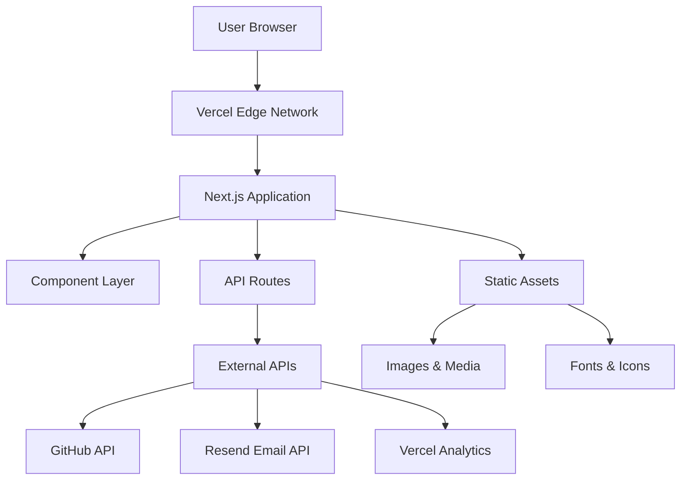
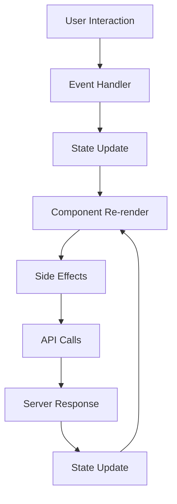
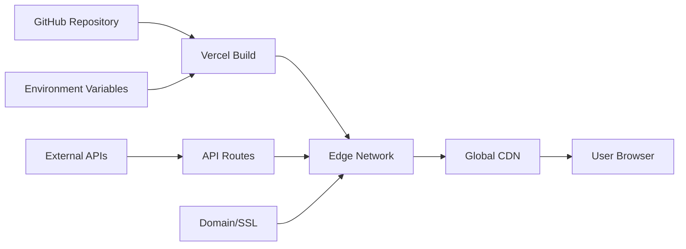

# Architecture Documentation

This document provides a comprehensive overview of the technical architecture, design patterns, and implementation details of the anmol.am portfolio project.

## 📋 Table of Contents

1. [System Overview](#system-overview)
2. [Architecture Patterns](#architecture-patterns)
3. [Project Structure](#project-structure)
4. [Component Architecture](#component-architecture)
5. [State Management](#state-management)
6. [Data Flow](#data-flow)
7. [API Integration](#api-integration)
8. [Performance Architecture](#performance-architecture)
9. [Security Considerations](#security-considerations)
10. [Deployment Architecture](#deployment-architecture)

## 🏗️ System Overview

### High-Level Architecture



### Technology Stack Architecture

```
┌─────────────────────────────────────────────────────────────┐
│                    Presentation Layer                      │
├─────────────────────────────────────────────────────────────┤
│ React 19 + Next.js 15 + TypeScript 5 + Tailwind CSS v4    │
│ Framer Motion + Lucide Icons + next-themes                 │
└─────────────────────────────────────────────────────────────┘
┌─────────────────────────────────────────────────────────────┐
│                    Application Layer                       │
├─────────────────────────────────────────────────────────────┤
│ Next.js App Router + React Server Components               │
│ Custom Hooks + Context Providers + Utilities               │
└─────────────────────────────────────────────────────────────┘
┌─────────────────────────────────────────────────────────────┐
│                    Integration Layer                       │
├─────────────────────────────────────────────────────────────┤
│ API Routes + External API Clients + Form Handlers          │
│ GitHub API + Resend Email + Vercel Analytics               │
└─────────────────────────────────────────────────────────────┘
┌─────────────────────────────────────────────────────────────┐
│                    Infrastructure Layer                    │
├─────────────────────────────────────────────────────────────┤
│ Vercel Platform + Edge Network + CDN + SSL                 │
│ Domain Management + Environment Variables                   │
└─────────────────────────────────────────────────────────────┘
```

## 🎯 Architecture Patterns

### 1. Component-Driven Architecture

**Pattern**: Atomic Design + Composition

```typescript
// Atomic Level - Basic UI elements
export function Button({ children, variant, ...props }: ButtonProps) {
  return <button className={buttonVariants({ variant })} {...props}>{children}</button>
}

// Molecular Level - Component combinations
export function SearchBox({ onSearch, placeholder }: SearchBoxProps) {
  return (
    <div className="search-container">
      <Input placeholder={placeholder} />
      <Button variant="primary">Search</Button>
    </div>
  )
}

// Organism Level - Complex components
export function CommandPalette() {
  return (
    <Modal>
      <SearchBox />
      <ResultsList />
      <KeyboardShortcuts />
    </Modal>
  )
}

// Template Level - Page layouts
export function PageLayout({ children }: LayoutProps) {
  return (
    <>
      <Header />
      <main>{children}</main>
      <Footer />
    </>
  )
}
```

### 2. Server-First Architecture

**Pattern**: React Server Components + Selective Hydration

```typescript
// Server Component (default)
export default function AboutPage() {
  const experiences = getExperiences() // Server-side data fetching
  
  return (
    <div>
      <ServerRenderedTimeline experiences={experiences} />
      <InteractiveWidget /> {/* Client component where needed */}
    </div>
  )
}

// Client Component (selective)
"use client"
export function InteractiveWidget() {
  const [state, setState] = useState()
  // Interactive functionality
}
```

### 3. Progressive Enhancement Pattern

**Implementation**: Feature Detection + Graceful Degradation

```typescript
// Base functionality works without JavaScript
export function ContactForm() {
  return (
    <form action="/api/contact" method="POST">
      <input name="email" required />
      <button type="submit">Send</button>
    </form>
  )
}

// Enhanced with JavaScript
"use client"
export function EnhancedContactForm() {
  const { register, handleSubmit } = useForm()
  
  return (
    <form onSubmit={handleSubmit(onSubmit)}>
      {/* Enhanced validation, real-time feedback */}
    </form>
  )
}
```

## 🗂️ Project Structure

### Directory Architecture

```
anmol.am/
├── app/                          # Next.js App Router (Route Handlers)
│   ├── layout.tsx               # Root layout with providers
│   ├── page.tsx                 # Homepage (Server Component)
│   ├── globals.css              # Global styles + CSS variables
│   ├── not-found.tsx            # 404 page
│   ├── about/
│   │   ├── page.tsx             # About page (Server Component)
│   │   └── loading.tsx          # Loading UI
│   ├── projects/
│   │   ├── page.tsx             # Projects listing (Server Component)
│   │   ├── [id]/
│   │   │   └── page.tsx         # Dynamic project pages
│   │   └── loading.tsx
│   ├── blog/
│   │   ├── page.tsx             # Blog listing
│   │   ├── [slug]/
│   │   │   └── page.tsx         # Dynamic blog posts (MDX)
│   │   └── components/
│   │       └── MDXComponents.tsx # Custom MDX components
│   ├── contact/
│   │   ├── page.tsx             # Contact page
│   │   └── components/
│   │       └── ContactForm.tsx  # Form component
│   ├── personal/
│   │   └── page.tsx             # Personal interests page
│   └── api/                     # API Routes
│       ├── analytics/
│       │   └── route.ts         # Analytics endpoint
│       └── contact/
│           └── route.ts         # Contact form handler
├── components/                   # Reusable UI Components
│   ├── ui/                      # Base UI components
│   │   ├── Button.tsx
│   │   ├── Input.tsx
│   │   ├── Modal.tsx
│   │   └── index.ts             # Barrel exports
│   ├── layout/                  # Layout components
│   │   ├── Header.tsx
│   │   ├── Footer.tsx
│   │   └── Navigation.tsx
│   ├── features/                # Feature-specific components
│   │   ├── CommandPalette.tsx
│   │   ├── Phase4Features.tsx
│   │   ├── InteractiveEffects.tsx
│   │   └── DrribbleInspiredFeatures.tsx
│   └── sections/                # Page section components
│       ├── Hero.tsx
│       ├── FeaturedProjects.tsx
│       └── Testimonials.tsx
├── lib/                         # Utility Libraries
│   ├── config.ts               # Site configuration
│   ├── utils.ts                # General utilities
│   ├── validations.ts          # Zod schemas
│   ├── api/                    # API utilities
│   │   ├── github.ts           # GitHub API client
│   │   ├── analytics.ts        # Analytics utilities
│   │   └── email.ts            # Email service clients
│   └── hooks/                  # Custom React hooks
│       ├── useLocalStorage.ts
│       ├── useMediaQuery.ts
│       └── useAnalytics.ts
├── types/                      # TypeScript Definitions
│   ├── index.ts               # Global types
│   ├── api.ts                 # API response types
│   └── components.ts          # Component prop types
├── public/                     # Static Assets
│   ├── images/                # Optimized images
│   │   ├── home_avatar.JPG
│   │   ├── about_avatar.JPG
│   │   ├── life_avatar.jpeg
│   │   └── projects/          # Project screenshots
│   ├── icons/                 # Icon files
│   ├── manifest.json          # PWA manifest
│   ├── sw.js                  # Service worker
│   ├── robots.txt             # SEO robots file
│   └── sitemap.xml            # SEO sitemap
├── styles/                     # Style-related files
│   └── components.css         # Component-specific styles
└── docs/                      # Documentation
    ├── ARCHITECTURE.md
    ├── DEPLOYMENT.md
    ├── CONTRIBUTING.md
    └── API.md
```

### Module Boundaries

```typescript
// Clear separation of concerns
import { Button } from '@/components/ui'           // UI components
import { siteConfig } from '@/lib/config'          // Configuration
import { fetchGitHubData } from '@/lib/api/github' // API clients
import { ProjectData } from '@/types'              // Type definitions
```

## 🧩 Component Architecture

### Component Hierarchy

```
App Layout
├── ThemeProvider
├── CommandPalette (Global)
├── ScrollProgress (Global)
├── CursorTrail (Global)
├── PWAInstallPrompt (Global)
├── Header
│   ├── Navigation
│   ├── CommandPaletteTrigger
│   └── ThemeToggle
├── Main Content
│   ├── Page Components (Server)
│   └── Interactive Components (Client)
└── Footer
    ├── LiveDashboard
    │   ├── VisitorCounter
    │   └── GitHubActivityFeed
    └── SocialLinks
```

### Component Types & Patterns

**1. Server Components (Default)**
```typescript
// app/about/page.tsx
import { Metadata } from 'next'

export const metadata: Metadata = {
  title: 'About',
  description: 'Learn more about Anmol Manchanda'
}

export default function AboutPage() {
  // Server-side rendering, no hydration needed
  const experiences = getExperiences() // Can be async
  
  return (
    <div>
      <Timeline experiences={experiences} />
    </div>
  )
}
```

**2. Client Components (Interactive)**
```typescript
// components/CommandPalette.tsx
"use client"

import { useState, useEffect } from 'react'

export function CommandPalette() {
  const [isOpen, setIsOpen] = useState(false)
  const [query, setQuery] = useState('')
  
  useEffect(() => {
    // Browser-only code
    const handleKeydown = (e: KeyboardEvent) => {
      if ((e.metaKey || e.ctrlKey) && e.key === 'k') {
        setIsOpen(true)
      }
    }
    
    document.addEventListener('keydown', handleKeydown)
    return () => document.removeEventListener('keydown', handleKeydown)
  }, [])
  
  return isOpen ? <Modal>...</Modal> : null
}
```

**3. Compound Components**
```typescript
// components/Card.tsx
const Card = ({ children, className }: CardProps) => (
  <div className={cn("card-base", className)}>
    {children}
  </div>
)

const CardHeader = ({ children }: CardHeaderProps) => (
  <div className="card-header">{children}</div>
)

const CardContent = ({ children }: CardContentProps) => (
  <div className="card-content">{children}</div>
)

Card.Header = CardHeader
Card.Content = CardContent

export { Card }

// Usage
<Card>
  <Card.Header>Title</Card.Header>
  <Card.Content>Content</Card.Content>
</Card>
```

### Custom Hook Architecture

```typescript
// lib/hooks/useAnalytics.ts
export function useAnalytics() {
  const [data, setData] = useState(null)
  const [loading, setLoading] = useState(true)
  
  useEffect(() => {
    async function fetchData() {
      try {
        const response = await fetch('/api/analytics')
        const analyticsData = await response.json()
        setData(analyticsData)
      } catch (error) {
        // Fallback to localStorage
        const visits = localStorage.getItem('portfolio-visits') || '0'
        setData({ totalVisits: parseInt(visits) })
      } finally {
        setLoading(false)
      }
    }
    
    fetchData()
    const interval = setInterval(fetchData, 30000) // Real-time updates
    return () => clearInterval(interval)
  }, [])
  
  return { data, loading }
}
```

## 🔄 State Management

### State Architecture Pattern

**1. Local Component State (useState)**
```typescript
// For simple, component-specific state
function CommandPalette() {
  const [isOpen, setIsOpen] = useState(false)
  const [query, setQuery] = useState('')
  // Component-local state only
}
```

**2. Context for Shared State**
```typescript
// contexts/ThemeContext.tsx
const ThemeContext = createContext<ThemeContextType | undefined>(undefined)

export function ThemeProvider({ children }: { children: React.ReactNode }) {
  const [theme, setTheme] = useState<'light' | 'dark'>('light')
  
  return (
    <ThemeContext.Provider value={{ theme, setTheme }}>
      {children}
    </ThemeContext.Provider>
  )
}

export function useTheme() {
  const context = useContext(ThemeContext)
  if (!context) throw new Error('useTheme must be used within ThemeProvider')
  return context
}
```

**3. URL State for Navigation**
```typescript
// Using Next.js router for state that should persist in URL
import { useRouter, useSearchParams } from 'next/navigation'

function ProjectsPage() {
  const router = useRouter()
  const searchParams = useSearchParams()
  const category = searchParams.get('category') || 'all'
  
  const updateCategory = (newCategory: string) => {
    const params = new URLSearchParams(searchParams)
    params.set('category', newCategory)
    router.push(`/projects?${params.toString()}`)
  }
}
```

**4. External State (API/Server)**
```typescript
// Using SWR-like pattern for server state
function useGitHubActivity() {
  const [data, setData] = useState([])
  const [error, setError] = useState(null)
  
  useEffect(() => {
    fetch('/api/github-activity')
      .then(res => res.json())
      .then(setData)
      .catch(setError)
  }, [])
  
  return { data, error, isLoading: !data && !error }
}
```

## 📊 Data Flow

### Data Flow Architecture



### API Data Flow

**1. Client-Side Data Fetching**
```typescript
// components/GitHubActivityFeed.tsx
export function GitHubActivityFeed() {
  const [activities, setActivities] = useState([])
  const [loading, setLoading] = useState(true)
  
  useEffect(() => {
    async function fetchActivity() {
      try {
        // Client-side API call
        const response = await fetch('/api/github-activity')
        const data = await response.json()
        setActivities(data)
      } catch (error) {
        // Fallback to mock data
        setActivities(mockData)
      } finally {
        setLoading(false)
      }
    }
    
    fetchActivity()
    const interval = setInterval(fetchActivity, 300000) // 5 minutes
    return () => clearInterval(interval)
  }, [])
  
  return loading ? <Skeleton /> : <ActivityList activities={activities} />
}
```

**2. Server-Side Data Fetching**
```typescript
// app/projects/page.tsx
async function getProjects(): Promise<Project[]> {
  // Server-side data fetching
  return [
    {
      id: '1',
      title: 'Enterprise Data Pipeline',
      // ... project data
    }
  ]
}

export default async function ProjectsPage() {
  const projects = await getProjects() // Server Component
  
  return (
    <div>
      {projects.map(project => (
        <ProjectCard key={project.id} project={project} />
      ))}
    </div>
  )
}
```

### Form Data Flow

```typescript
// app/contact/page.tsx
"use client"

import { useForm } from 'react-hook-form'
import { zodResolver } from '@hookform/resolvers/zod'
import { contactSchema } from '@/lib/validations'

export function ContactForm() {
  const {
    register,
    handleSubmit,
    formState: { errors, isSubmitting }
  } = useForm({
    resolver: zodResolver(contactSchema)
  })
  
  const onSubmit = async (data: ContactFormData) => {
    try {
      const response = await fetch('/api/contact', {
        method: 'POST',
        headers: { 'Content-Type': 'application/json' },
        body: JSON.stringify(data)
      })
      
      if (response.ok) {
        // Success handling
        toast.success('Message sent successfully!')
      } else {
        throw new Error('Failed to send message')
      }
    } catch (error) {
      toast.error('Failed to send message. Please try again.')
    }
  }
  
  return (
    <form onSubmit={handleSubmit(onSubmit)}>
      <input {...register('email')} />
      {errors.email && <span>{errors.email.message}</span>}
      <button type="submit" disabled={isSubmitting}>
        {isSubmitting ? 'Sending...' : 'Send Message'}
      </button>
    </form>
  )
}
```

## 🔌 API Integration

### API Architecture

```typescript
// lib/api/github.ts
export class GitHubAPIClient {
  private baseURL = 'https://api.github.com'
  private token?: string
  
  constructor(token?: string) {
    this.token = token
  }
  
  private async request<T>(endpoint: string): Promise<T> {
    const headers: Record<string, string> = {
      'Accept': 'application/vnd.github.v3+json',
      'User-Agent': 'anmol.am-portfolio'
    }
    
    if (this.token) {
      headers['Authorization'] = `token ${this.token}`
    }
    
    const response = await fetch(`${this.baseURL}${endpoint}`, {
      headers,
      next: { revalidate: 300 } // Cache for 5 minutes
    })
    
    if (!response.ok) {
      throw new Error(`GitHub API error: ${response.status}`)
    }
    
    return response.json()
  }
  
  async getUserEvents(username: string): Promise<GitHubEvent[]> {
    return this.request(`/users/${username}/events/public?per_page=10`)
  }
  
  async getRepository(owner: string, repo: string): Promise<Repository> {
    return this.request(`/repos/${owner}/${repo}`)
  }
}
```

### API Route Implementation

```typescript
// app/api/analytics/route.ts
import { NextRequest, NextResponse } from 'next/server'

export async function GET(request: NextRequest) {
  try {
    // Real analytics implementation would go here
    // For now, return basic metrics with localStorage fallback
    
    const analytics = {
      totalVisits: 1234,
      uniqueVisitors: 867,
      onlineNow: Math.floor(Math.random() * 10) + 1,
      bounceRate: 32.5,
      avgSession: '3:45'
    }
    
    return NextResponse.json(analytics)
  } catch (error) {
    console.error('Analytics API error:', error)
    return NextResponse.json(
      { error: 'Failed to fetch analytics' },
      { status: 500 }
    )
  }
}
```

### Error Handling & Fallbacks

```typescript
// lib/api/with-fallback.ts
export async function withFallback<T>(
  primary: () => Promise<T>,
  fallback: T,
  options: { timeout?: number } = {}
): Promise<T> {
  try {
    const { timeout = 5000 } = options
    
    const timeoutPromise = new Promise<never>((_, reject) =>
      setTimeout(() => reject(new Error('Timeout')), timeout)
    )
    
    return await Promise.race([primary(), timeoutPromise])
  } catch (error) {
    console.warn('Primary API failed, using fallback:', error)
    return fallback
  }
}

// Usage
const githubData = await withFallback(
  () => githubClient.getUserEvents('anmolmanchanda'),
  mockGitHubData,
  { timeout: 3000 }
)
```

## ⚡ Performance Architecture

### Performance Strategies

**1. Code Splitting**
```typescript
// Automatic route-based splitting
// Each page is automatically split

// Manual component splitting
const HeavyComponent = dynamic(() => import('./HeavyComponent'), {
  loading: () => <Skeleton />,
  ssr: false // Client-side only if needed
})
```

**2. Image Optimization**
```typescript
// Next.js Image component with optimization
import Image from 'next/image'

<Image
  src="/images/home_avatar.JPG"
  alt="Anmol Manchanda"
  width={256}
  height={256}
  priority // For above-the-fold images
  placeholder="blur"
  blurDataURL="data:image/jpeg;base64,..."
/>
```

**3. Caching Strategy**
```typescript
// API route caching
export async function GET() {
  const data = await fetchData()
  
  return NextResponse.json(data, {
    headers: {
      'Cache-Control': 's-maxage=300, stale-while-revalidate=86400'
    }
  })
}

// Client-side caching
const cachedFetch = (url: string) => {
  const cached = cache.get(url)
  if (cached && Date.now() - cached.timestamp < 300000) {
    return cached.data
  }
  
  return fetch(url).then(data => {
    cache.set(url, { data, timestamp: Date.now() })
    return data
  })
}
```

**4. Animation Performance**
```typescript
// Use CSS transforms for performance
const animationVariants = {
  initial: { 
    opacity: 0, 
    transform: 'translateY(20px)' // GPU-accelerated
  },
  animate: { 
    opacity: 1, 
    transform: 'translateY(0px)' 
  }
}

// Reduce motion for performance
const prefersReducedMotion = useMediaQuery('(prefers-reduced-motion: reduce)')

<motion.div
  variants={prefersReducedMotion ? reducedMotionVariants : animationVariants}
  initial="initial"
  animate="animate"
/>
```

### Bundle Analysis

```bash
# Analyze bundle size
npm run build
npx @next/bundle-analyzer

# Core Web Vitals monitoring
# Implemented in components/Analytics.tsx
```

## 🔒 Security Considerations

### Security Architecture

**1. Input Validation**
```typescript
// lib/validations.ts
import { z } from 'zod'

export const contactSchema = z.object({
  name: z.string().min(2).max(100),
  email: z.string().email(),
  subject: z.string().min(5).max(200),
  message: z.string().min(10).max(1000)
})

// API route validation
export async function POST(request: NextRequest) {
  try {
    const body = await request.json()
    const validatedData = contactSchema.parse(body)
    // Process validated data
  } catch (error) {
    return NextResponse.json({ error: 'Invalid input' }, { status: 400 })
  }
}
```

**2. Environment Variable Security**
```typescript
// Server-side only secrets
const RESEND_API_KEY = process.env.RESEND_API_KEY // Never exposed to client

// Client-side safe variables
const SITE_URL = process.env.NEXT_PUBLIC_SITE_URL // Safe to expose

// Runtime validation
if (!RESEND_API_KEY) {
  throw new Error('RESEND_API_KEY is required')
}
```

**3. Rate Limiting**
```typescript
// lib/rate-limit.ts
const rateLimit = new Map()

export function checkRateLimit(ip: string, limit = 5, window = 60000) {
  const now = Date.now()
  const userRequests = rateLimit.get(ip) || []
  
  // Clean old requests
  const validRequests = userRequests.filter((time: number) => now - time < window)
  
  if (validRequests.length >= limit) {
    return false
  }
  
  validRequests.push(now)
  rateLimit.set(ip, validRequests)
  return true
}
```

**4. CORS & Security Headers**
```typescript
// next.config.js
const nextConfig = {
  async headers() {
    return [
      {
        source: '/(.*)',
        headers: [
          {
            key: 'X-Frame-Options',
            value: 'DENY'
          },
          {
            key: 'X-Content-Type-Options',
            value: 'nosniff'
          },
          {
            key: 'Referrer-Policy',
            value: 'strict-origin-when-cross-origin'
          },
          {
            key: 'Content-Security-Policy',
            value: "default-src 'self'; img-src 'self' data: https:; script-src 'self' 'unsafe-inline' 'unsafe-eval'"
          }
        ]
      }
    ]
  }
}
```

## 🚀 Deployment Architecture

### Infrastructure Overview



### Build Pipeline

```yaml
# .github/workflows/deploy.yml (if using GitHub Actions)
name: Deploy to Vercel
on:
  push:
    branches: [main]
    
jobs:
  deploy:
    runs-on: ubuntu-latest
    steps:
      - uses: actions/checkout@v4
      
      - name: Setup Node.js
        uses: actions/setup-node@v4
        with:
          node-version: '18'
          cache: 'npm'
      
      - name: Install dependencies
        run: npm ci
      
      - name: Run linting
        run: npm run lint
      
      - name: Type check
        run: npm run type-check
      
      - name: Build application
        run: npm run build
        env:
          NEXT_PUBLIC_SITE_URL: ${{ secrets.SITE_URL }}
      
      - name: Deploy to Vercel
        uses: amondnet/vercel-action@v25
        with:
          vercel-token: ${{ secrets.VERCEL_TOKEN }}
```

### Edge Function Architecture

```typescript
// middleware.ts
import { NextResponse } from 'next/server'
import type { NextRequest } from 'next/server'

export function middleware(request: NextRequest) {
  // Geographic routing
  const country = request.geo?.country || 'US'
  
  // Security headers
  const response = NextResponse.next()
  response.headers.set('X-Country', country)
  response.headers.set('X-Frame-Options', 'DENY')
  
  // Rate limiting for API routes
  if (request.nextUrl.pathname.startsWith('/api/')) {
    const ip = request.ip || 'anonymous'
    // Implement rate limiting logic
  }
  
  return response
}

export const config = {
  matcher: [
    '/((?!_next/static|_next/image|favicon.ico).*)',
  ],
}
```

### Monitoring & Observability

```typescript
// lib/monitoring.ts
export function trackPerformance(name: string, duration: number) {
  // Send to analytics service
  if (typeof window !== 'undefined') {
    // Client-side performance tracking
    performance.mark(name)
  }
}

export function trackError(error: Error, context?: string) {
  console.error('Application error:', error, context)
  
  // Send to error tracking service
  if (process.env.NODE_ENV === 'production') {
    // Integration with Sentry, LogRocket, etc.
  }
}
```

This architecture documentation provides a comprehensive overview of the technical design decisions, patterns, and implementation details that make the anmol.am portfolio a robust, scalable, and maintainable application.