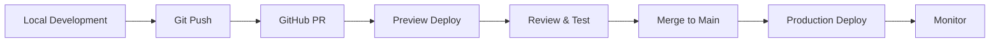

# 🚀 Deployment & CI/CD Guide

## 📋 Deployment Overview

**Primary Platform**: Vercel  
**Domain**: anmol.am  
**SSL**: Automatic via Vercel  
**CDN**: Vercel Edge Network  

## 🔄 Deployment Workflow

### Standard Deployment Process


## 🎯 Pre-Deployment Checklist

### Before Every Deploy:
```bash
# 1. Run all checks
npm run lint
npm run typecheck
npm run test
npm run build

# 2. Check bundle size
npm run analyze

# 3. Test locally
npm run start  # Production mode

# 4. Update version
npm version patch  # or minor/major

# 5. Commit and push
git add .
git commit -m "Release: v1.2.3"
git push
```

## 🔧 Vercel Configuration

### vercel.json
```json
{
  "framework": "nextjs",
  "buildCommand": "npm run build",
  "devCommand": "npm run dev",
  "installCommand": "npm install",
  "regions": ["iad1"],
  "functions": {
    "app/api/*": {
      "maxDuration": 10
    }
  },
  "headers": [
    {
      "source": "/(.*)",
      "headers": [
        {
          "key": "X-Content-Type-Options",
          "value": "nosniff"
        },
        {
          "key": "X-Frame-Options",
          "value": "DENY"
        },
        {
          "key": "X-XSS-Protection",
          "value": "1; mode=block"
        }
      ]
    }
  ],
  "redirects": [
    {
      "source": "/resume",
      "destination": "/Anmol's Resume.pdf",
      "permanent": false
    }
  ]
}
```

### Environment Variables
```bash
# Production (.env.production)
NEXT_PUBLIC_SITE_URL=https://anmol.am
VERCEL_URL=$VERCEL_URL
KV_URL=$KV_URL
KV_REST_API_URL=$KV_REST_API_URL
KV_REST_API_TOKEN=$KV_REST_API_TOKEN
KV_REST_API_READ_ONLY_TOKEN=$KV_REST_API_READ_ONLY_TOKEN
RESEND_API_KEY=$RESEND_API_KEY
EMAIL_FROM=noreply@anmol.am
EMAIL_TO=contact@anmol.am
GITHUB_TOKEN=$GITHUB_TOKEN
```

## 🌍 Deployment Environments

### Development
```bash
# Local development
npm run dev
# Access: http://localhost:3000
```

### Preview
```bash
# Automatic on PR
# Access: https://anmol-am-pr-*.vercel.app
```

### Production
```bash
# Automatic on main branch
# Access: https://anmol.am
```

## 📦 Build Optimization

### Next.js Build Config
```javascript
// next.config.js
module.exports = {
  output: 'standalone',
  compress: true,
  poweredByHeader: false,
  reactStrictMode: true,
  swcMinify: true,
  images: {
    domains: ['images.unsplash.com'],
    formats: ['image/avif', 'image/webp'],
  },
  experimental: {
    optimizeCss: true,
    optimizePackageImports: ['framer-motion', 'lucide-react'],
  }
}
```

### Build Time Optimization
```bash
# Cache dependencies
npm ci --prefer-offline

# Parallel builds
npm run build -- --parallel

# Analyze bundle
npm run build -- --analyze
```

## 🔄 CI/CD Pipeline

### GitHub Actions Workflow
```yaml
# .github/workflows/deploy.yml
name: Deploy

on:
  push:
    branches: [main]
  pull_request:
    branches: [main]

jobs:
  test:
    runs-on: ubuntu-latest
    steps:
      - uses: actions/checkout@v3
      
      - name: Setup Node
        uses: actions/setup-node@v3
        with:
          node-version: '18'
          cache: 'npm'
      
      - name: Install dependencies
        run: npm ci
      
      - name: Run tests
        run: |
          npm run lint
          npm run typecheck
          npm run test
          npm run build
      
      - name: Run Lighthouse
        uses: treosh/lighthouse-ci-action@v9
        with:
          urls: |
            https://${{ github.event.pull_request.number }}-anmol-am.vercel.app
          uploadArtifacts: true

  deploy:
    needs: test
    runs-on: ubuntu-latest
    if: github.ref == 'refs/heads/main'
    
    steps:
      - uses: actions/checkout@v3
      
      - name: Deploy to Vercel
        uses: amondnet/vercel-action@v25
        with:
          vercel-token: ${{ secrets.VERCEL_TOKEN }}
          vercel-org-id: ${{ secrets.VERCEL_ORG_ID }}
          vercel-project-id: ${{ secrets.VERCEL_PROJECT_ID }}
          vercel-args: '--prod'
```

## 🚦 Deployment Monitoring

### Health Checks
```typescript
// app/api/health/route.ts
export async function GET() {
  try {
    // Check database
    await kv.ping()
    
    // Check external services
    const services = {
      database: 'healthy',
      cache: 'healthy',
      email: 'healthy'
    }
    
    return Response.json({
      status: 'healthy',
      timestamp: new Date().toISOString(),
      services
    })
  } catch (error) {
    return Response.json({
      status: 'unhealthy',
      error: error.message
    }, { status: 503 })
  }
}
```

### Monitoring Setup
```javascript
// Vercel Analytics
import { Analytics } from '@vercel/analytics/react'

// Speed Insights
import { SpeedInsights } from '@vercel/speed-insights/next'

// Custom monitoring
import * as Sentry from '@sentry/nextjs'

Sentry.init({
  dsn: process.env.SENTRY_DSN,
  environment: process.env.NODE_ENV,
  tracesSampleRate: 0.1,
})
```

## 🔄 Rollback Procedures

### Quick Rollback
```bash
# Via Vercel Dashboard
1. Go to Deployments
2. Find last working deployment
3. Click "Promote to Production"

# Via CLI
vercel rollback
```

### Git Rollback
```bash
# Revert commit
git revert HEAD
git push

# Or reset to previous commit
git reset --hard HEAD~1
git push --force
```

## 📊 Performance Budget

### Build Limits
```javascript
// Maximum sizes
{
  "performance": {
    "maxAssetSize": 500000,        // 500KB
    "maxEntrypointSize": 1000000,  // 1MB
    "hints": "error"
  }
}
```

### Runtime Limits
- **API Routes**: 10 second timeout
- **Static Generation**: 60 second timeout
- **Image Optimization**: 1000 images/month
- **Bandwidth**: 100GB/month

## 🌐 CDN & Caching

### Cache Configuration
```typescript
// Static assets (immutable)
export const config = {
  headers: {
    'Cache-Control': 'public, immutable, max-age=31536000'
  }
}

// Dynamic content (revalidate)
export const revalidate = 3600 // 1 hour

// API routes
res.setHeader('Cache-Control', 's-maxage=60, stale-while-revalidate')
```

### CDN Purge
```bash
# Purge cache via API
curl -X POST https://api.vercel.com/v1/deployments/purge \
  -H "Authorization: Bearer $VERCEL_TOKEN" \
  -d '{"url": "https://anmol.am/*"}'
```

## 🔐 Security Deployment

### SSL/TLS
- Automatic SSL via Let's Encrypt
- Force HTTPS redirect
- HSTS enabled
- TLS 1.3 support

### Security Headers
```typescript
// middleware.ts
export function middleware(request: NextRequest) {
  const response = NextResponse.next()
  
  // Security headers
  response.headers.set('X-Content-Type-Options', 'nosniff')
  response.headers.set('X-Frame-Options', 'DENY')
  response.headers.set('X-XSS-Protection', '1; mode=block')
  response.headers.set('Referrer-Policy', 'origin-when-cross-origin')
  response.headers.set('Permissions-Policy', 'geolocation=(), microphone=(), camera=()')
  
  return response
}
```

## 📱 Progressive Web App

### PWA Configuration
```javascript
// next.config.js
const withPWA = require('next-pwa')({
  dest: 'public',
  register: true,
  skipWaiting: true,
  disable: process.env.NODE_ENV === 'development'
})

module.exports = withPWA(nextConfig)
```

### Service Worker
```javascript
// public/sw.js
self.addEventListener('install', (event) => {
  event.waitUntil(
    caches.open('v1').then((cache) => {
      return cache.addAll([
        '/',
        '/offline.html',
        '/manifest.json'
      ])
    })
  )
})
```

## 🚨 Emergency Procedures

### Site Down
1. Check Vercel Status: https://vercel-status.com
2. Check deployment logs
3. Rollback if needed
4. Contact support if persistent

### High Traffic
1. Enable DDoS protection
2. Increase rate limits
3. Scale functions
4. Enable queue system

### Security Breach
1. Rotate all secrets immediately
2. Audit recent deployments
3. Check access logs
4. Enable 2FA everywhere

## 📈 Post-Deployment

### Verification Checklist
- [ ] Site loads correctly
- [ ] All pages accessible
- [ ] Forms working
- [ ] API endpoints responding
- [ ] Analytics tracking
- [ ] SEO meta tags present
- [ ] Images loading
- [ ] Performance acceptable
- [ ] No console errors
- [ ] Mobile responsive

### Monitoring Dashboard
```bash
# Key metrics to track
- Response time < 200ms
- Error rate < 1%
- Uptime > 99.9%
- Core Web Vitals passing
- SSL certificate valid
```

## 🔗 Deployment Commands

### Quick Reference
```bash
# Deploy to production
vercel --prod

# Deploy with environment
vercel --prod --env NODE_ENV=production

# Check deployment status
vercel ls

# View logs
vercel logs

# Set environment variable
vercel env add SECRET_KEY production

# Rollback
vercel rollback

# Remove deployment
vercel rm [deployment-url]
```

## 📋 Deployment Schedule

### Regular Deployments
- **Features**: Weekly (Fridays)
- **Bug fixes**: As needed
- **Security**: Immediate
- **Content**: Daily

### Maintenance Windows
- **Time**: 2-4 AM UTC
- **Duration**: < 30 minutes
- **Notification**: 24 hours advance

---

**Last Updated**: January 19, 2025  
**Platform**: Vercel  
**Status**: Production Ready